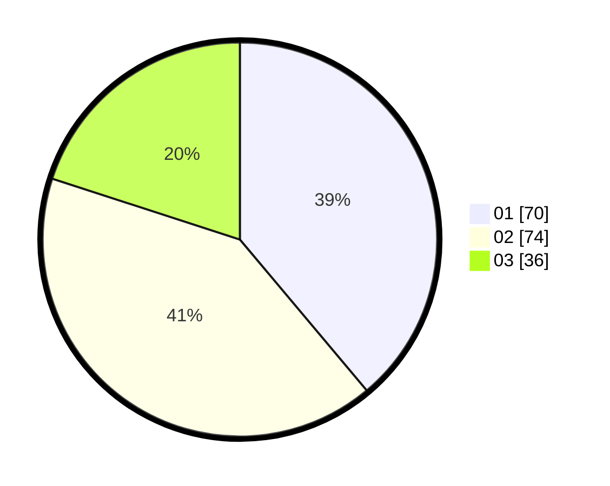

# Hasil

Hasil perolehan suara paslon dapat dilihat pada file paslon-01.txt, paslon-02.txt, dan paslon-03.txt.

Jika tidak ada, artinya data tersebut belum ada pada SIREKAP.

## Perolehan Suara

 * Paslon 01: **70**.
 * Paslon 02: **74**.
 * Paslon 03: **36**.

## Foto C Plano

https://sirekap-obj-formc.kpu.go.id/c5c0/pemilu/ppwp/31/75/06/10/03/3175061003174-20240216-000957--b433a88b-55a0-425f-b872-54491a2730bd.jpg

https://sirekap-obj-formc.kpu.go.id/c5c0/pemilu/ppwp/31/75/06/10/03/3175061003174-20240216-000958--2e3261c5-0a74-4421-9fd0-960751648102.jpg

https://sirekap-obj-formc.kpu.go.id/c5c0/pemilu/ppwp/31/75/06/10/03/3175061003174-20240216-000957--1639bad9-5129-408f-aa3f-044119913024.jpg

## DATA PEMILIH TETAP

Jumlah pemilih dalam DPT: **262**.
 * L: **130**.
 * P: **132**.

## DATA PENGGUNA HAK PILIH

Jumlah pengguna hak pilih dalam DPT: **186**.
 * L: **89**.
 * P: **97**.

Jumlah pengguna hak pilih dalam DPTb: **0**.
 * L: **0**.
 * P: **0**.

Jumlah pengguna hak pilih dalam DPK: **0**.
 * L: **0**.
 * P: **0**.

Jumlah pengguna hak pilih: **186**.
 * L: **89**.
 * P: **97**.

## JUMLAH SUARA SAH DAN TIDAK SAH

JUMLAH SELURUH SUARA SAH: **180**.

JUMLAH SUARA TIDAK SAH: **6**.

JUMLAH SELURUH SUARA SAH DAN SUARA TIDAK SAH: **186**.
