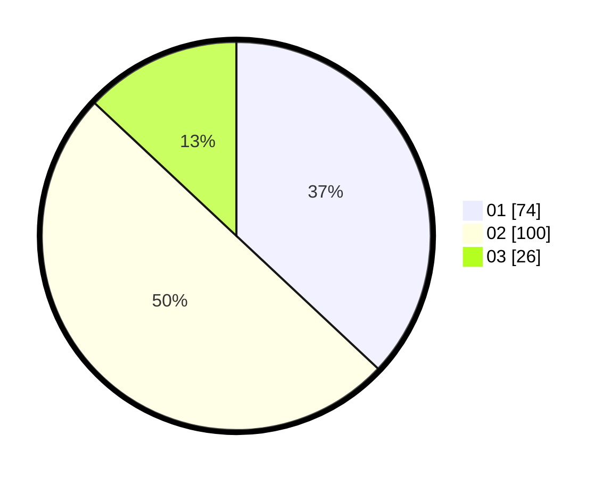

# Hasil

Hasil perolehan suara paslon dapat dilihat pada file paslon-01.txt, paslon-02.txt, dan paslon-03.txt.

Jika tidak ada, artinya data tersebut belum ada pada SIREKAP.

## Perolehan Suara

 * Paslon 01: **74**.
 * Paslon 02: **100**.
 * Paslon 03: **26**.

## Foto C Plano

https://sirekap-obj-formc.kpu.go.id/77b7/pemilu/ppwp/31/75/06/10/03/3175061003179-20240214-200253--daa09627-540f-4a79-9146-fe668a33a5d0.jpg

https://sirekap-obj-formc.kpu.go.id/77b7/pemilu/ppwp/31/75/06/10/03/3175061003179-20240214-200615--58edf59d-1633-44e1-8899-2e5045cdf94f.jpg

https://sirekap-obj-formc.kpu.go.id/77b7/pemilu/ppwp/31/75/06/10/03/3175061003179-20240214-200749--7cd7a4aa-b390-4d90-8e6b-d7f0ca8f3cc2.jpg

## DATA PEMILIH TETAP

Jumlah pemilih dalam DPT: **261**.
 * L: **142**.
 * P: **119**.

## DATA PENGGUNA HAK PILIH

Jumlah pengguna hak pilih dalam DPT: **197**.
 * L: **105**.
 * P: **92**.

Jumlah pengguna hak pilih dalam DPTb: **4**.
 * L: **1**.
 * P: **3**.

Jumlah pengguna hak pilih dalam DPK: **1**.
 * L: **0**.
 * P: **1**.

Jumlah pengguna hak pilih: **202**.
 * L: **106**.
 * P: **96**.

## JUMLAH SUARA SAH DAN TIDAK SAH

JUMLAH SELURUH SUARA SAH: **200**.

JUMLAH SUARA TIDAK SAH: **2**.

JUMLAH SELURUH SUARA SAH DAN SUARA TIDAK SAH: **202**.
