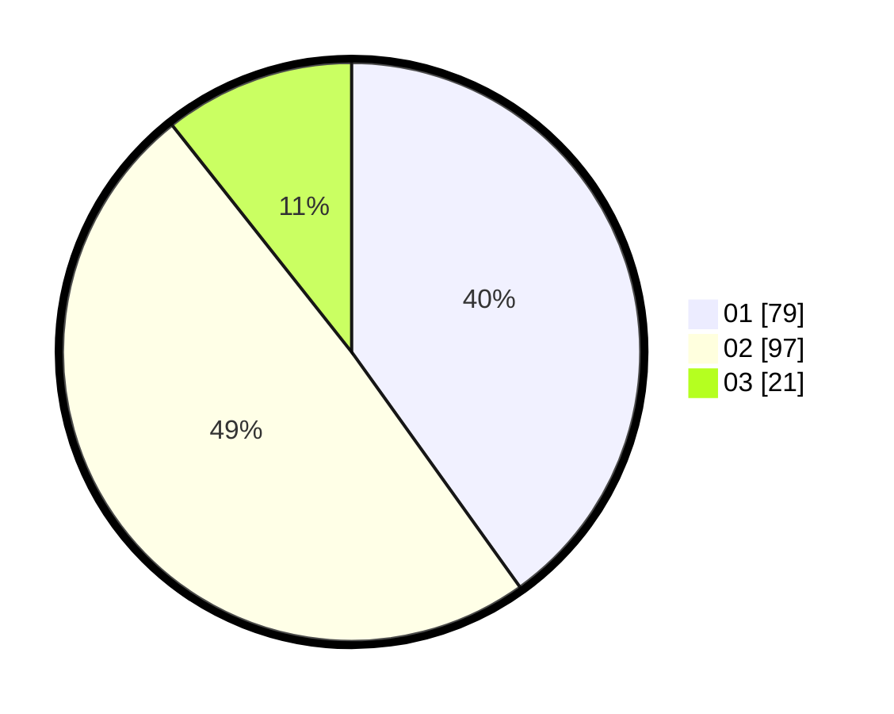

# Hasil

Hasil perolehan suara paslon dapat dilihat pada file paslon-01.txt, paslon-02.txt, dan paslon-03.txt.

Jika tidak ada, artinya data tersebut belum ada pada SIREKAP.

## Perolehan Suara

 * Paslon 01: **79**.
 * Paslon 02: **97**.
 * Paslon 03: **21**.

## Foto C Plano

https://sirekap-obj-formc.kpu.go.id/bb85/pemilu/ppwp/31/75/06/10/03/3175061003182-20240214-155754--da8beea2-1f9b-40a0-97f7-5994a83b3f53.jpg

https://sirekap-obj-formc.kpu.go.id/bb85/pemilu/ppwp/31/75/06/10/03/3175061003182-20240214-155822--a29244a7-c6ea-414c-92eb-96711d181a49.jpg

https://sirekap-obj-formc.kpu.go.id/bb85/pemilu/ppwp/31/75/06/10/03/3175061003182-20240214-155836--994a2a72-d67d-43f4-9a7f-c38924fcf1a1.jpg

## DATA PEMILIH TETAP

Jumlah pemilih dalam DPT: **262**.
 * L: **117**.
 * P: **145**.

## DATA PENGGUNA HAK PILIH

Jumlah pengguna hak pilih dalam DPT: **195**.
 * L: **78**.
 * P: **117**.

Jumlah pengguna hak pilih dalam DPTb: **1**.
 * L: **1**.
 * P: **0**.

Jumlah pengguna hak pilih dalam DPK: **3**.
 * L: **1**.
 * P: **2**.

Jumlah pengguna hak pilih: **199**.
 * L: **80**.
 * P: **119**.

## JUMLAH SUARA SAH DAN TIDAK SAH

JUMLAH SELURUH SUARA SAH: **197**.

JUMLAH SUARA TIDAK SAH: **2**.

JUMLAH SELURUH SUARA SAH DAN SUARA TIDAK SAH: **199**.
