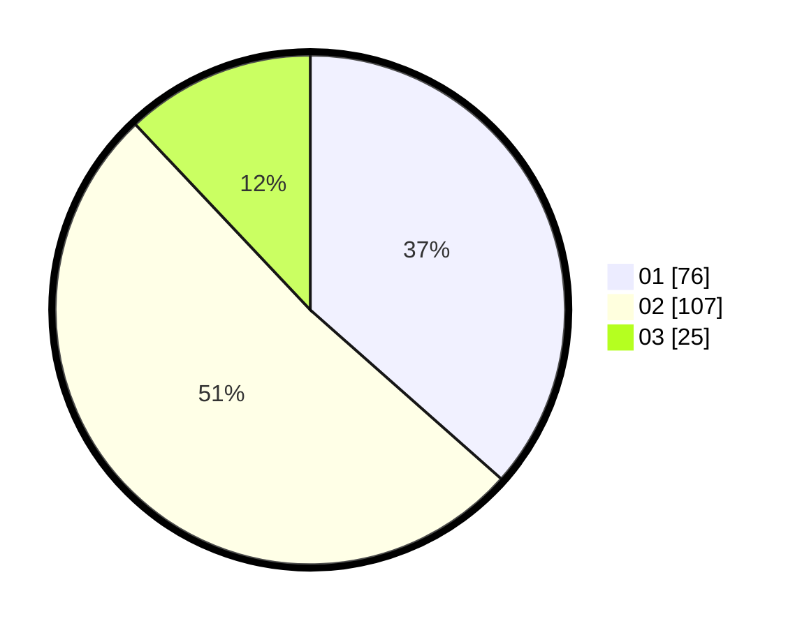

# Hasil

Hasil perolehan suara paslon dapat dilihat pada file paslon-01.txt, paslon-02.txt, dan paslon-03.txt.

Jika tidak ada, artinya data tersebut belum ada pada SIREKAP.

## Perolehan Suara

 * Paslon 01: **76**.
 * Paslon 02: **107**.
 * Paslon 03: **25**.

## Foto C Plano

https://sirekap-obj-formc.kpu.go.id/e2c0/pemilu/ppwp/31/75/06/10/03/3175061003187-20240214-223815--0eeb2c58-5d19-4604-90b8-a092bcc987df.jpg

https://sirekap-obj-formc.kpu.go.id/e2c0/pemilu/ppwp/31/75/06/10/03/3175061003187-20240214-223916--1da7fae9-a422-439a-9f8b-ebf962fd09bb.jpg

https://sirekap-obj-formc.kpu.go.id/e2c0/pemilu/ppwp/31/75/06/10/03/3175061003187-20240214-224043--9b6b08dd-0cc9-4476-a32b-a148bb7dd916.jpg

## DATA PEMILIH TETAP

Jumlah pemilih dalam DPT: **267**.
 * L: **137**.
 * P: **130**.

## DATA PENGGUNA HAK PILIH

Jumlah pengguna hak pilih dalam DPT: **210**.
 * L: **98**.
 * P: **112**.

Jumlah pengguna hak pilih dalam DPTb: **0**.
 * L: **0**.
 * P: **0**.

Jumlah pengguna hak pilih dalam DPK: **2**.
 * L: **0**.
 * P: **2**.

Jumlah pengguna hak pilih: **212**.
 * L: **98**.
 * P: **119**.

## JUMLAH SUARA SAH DAN TIDAK SAH

JUMLAH SELURUH SUARA SAH: **208**.

JUMLAH SUARA TIDAK SAH: **4**.

JUMLAH SELURUH SUARA SAH DAN SUARA TIDAK SAH: **212**.
