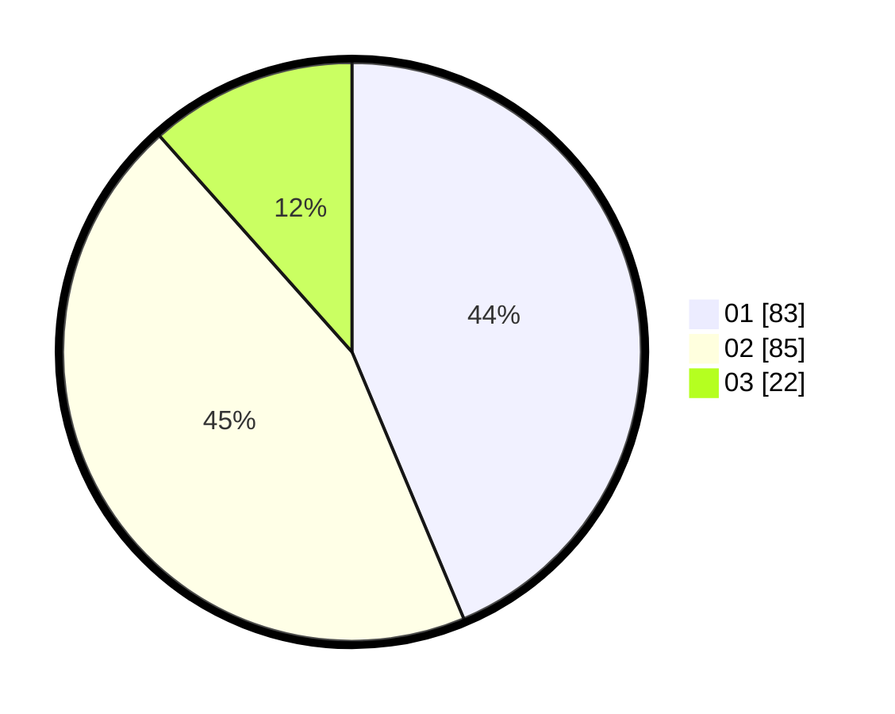

# Hasil

Hasil perolehan suara paslon dapat dilihat pada file paslon-01.txt, paslon-02.txt, dan paslon-03.txt.

Jika tidak ada, artinya data tersebut belum ada pada SIREKAP.

## Perolehan Suara

 * Paslon 01: **83**.
 * Paslon 02: **85**.
 * Paslon 03: **22**.

## Foto C Plano

https://sirekap-obj-formc.kpu.go.id/8735/pemilu/ppwp/31/75/06/10/03/3175061003195-20240216-032411--e55ef6f6-4347-4f54-9cb1-94f2b779aaae.jpg

https://sirekap-obj-formc.kpu.go.id/8735/pemilu/ppwp/31/75/06/10/03/3175061003195-20240216-032412--b6ae53a9-cd00-4209-90ae-7c3dd18da1ec.jpg

https://sirekap-obj-formc.kpu.go.id/8735/pemilu/ppwp/31/75/06/10/03/3175061003195-20240216-032412--b0cbe409-f7ac-4f17-a702-89326c291b0a.jpg

## DATA PEMILIH TETAP

Jumlah pemilih dalam DPT: **244**.
 * L: **125**.
 * P: **119**.

## DATA PENGGUNA HAK PILIH

Jumlah pengguna hak pilih dalam DPT: **186**.
 * L: **89**.
 * P: **97**.

Jumlah pengguna hak pilih dalam DPTb: **2**.
 * L: **2**.
 * P: **0**.

Jumlah pengguna hak pilih dalam DPK: **5**.
 * L: **3**.
 * P: **2**.

Jumlah pengguna hak pilih: **193**.
 * L: **94**.
 * P: **99**.

## JUMLAH SUARA SAH DAN TIDAK SAH

JUMLAH SELURUH SUARA SAH: **190**.

JUMLAH SUARA TIDAK SAH: **3**.

JUMLAH SELURUH SUARA SAH DAN SUARA TIDAK SAH: **193**.
