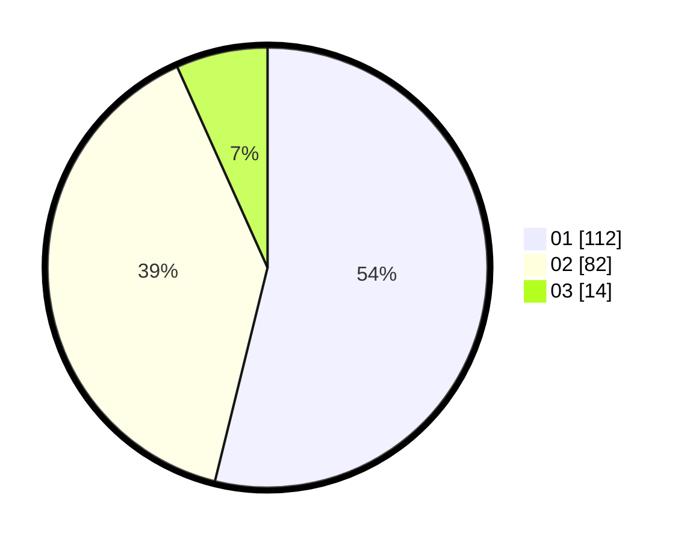

# Hasil

Hasil perolehan suara paslon dapat dilihat pada file paslon-01.txt, paslon-02.txt, dan paslon-03.txt.

Jika tidak ada, artinya data tersebut belum ada pada SIREKAP.

## Perolehan Suara

 * Paslon 01: **112**.
 * Paslon 02: **82**.
 * Paslon 03: **14**.

## Foto C Plano

https://sirekap-obj-formc.kpu.go.id/3fac/pemilu/ppwp/31/75/06/10/03/3175061003197-20240214-155356--d2b54bf9-9685-4817-ac4f-e5fd850195ec.jpg

https://sirekap-obj-formc.kpu.go.id/3fac/pemilu/ppwp/31/75/06/10/03/3175061003197-20240216-050702--217135b0-88d4-4f2a-a568-6ee658a12d90.jpg

https://sirekap-obj-formc.kpu.go.id/3fac/pemilu/ppwp/31/75/06/10/03/3175061003197-20240216-050701--b5c101fd-76ad-44d0-ba7a-4cfede8b9a67.jpg

## DATA PEMILIH TETAP

Jumlah pemilih dalam DPT: **276**.
 * L: **141**.
 * P: **135**.

## DATA PENGGUNA HAK PILIH

Jumlah pengguna hak pilih dalam DPT: **205**.
 * L: **104**.
 * P: **101**.

Jumlah pengguna hak pilih dalam DPTb: **2**.
 * L: **1**.
 * P: **1**.

Jumlah pengguna hak pilih dalam DPK: **3**.
 * L: **1**.
 * P: **2**.

Jumlah pengguna hak pilih: **210**.
 * L: **106**.
 * P: **104**.

## JUMLAH SUARA SAH DAN TIDAK SAH

JUMLAH SELURUH SUARA SAH: **208**.

JUMLAH SUARA TIDAK SAH: **2**.

JUMLAH SELURUH SUARA SAH DAN SUARA TIDAK SAH: **210**.
