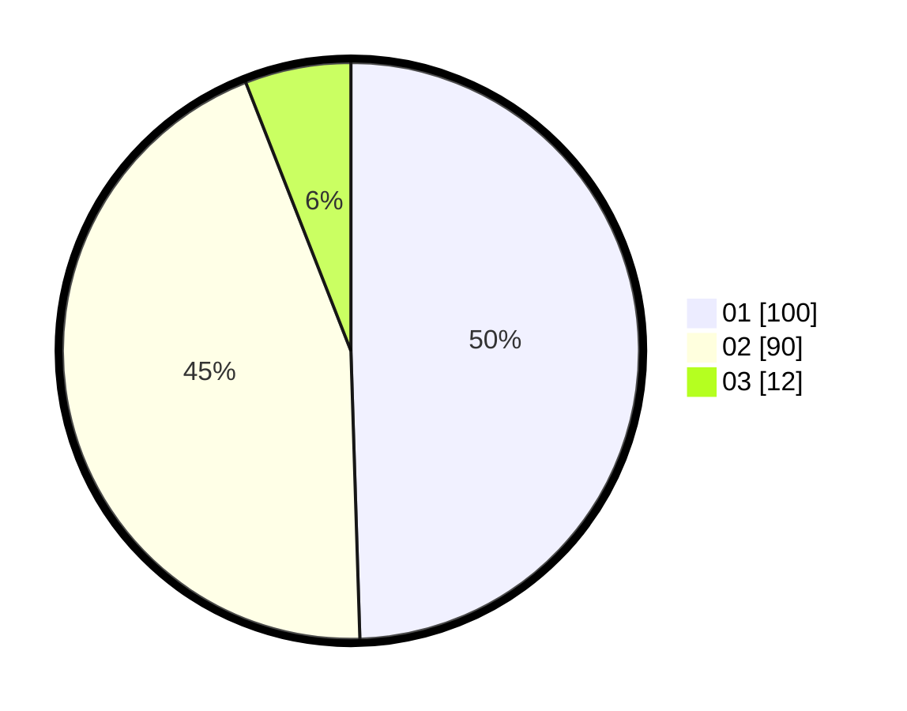

# Hasil

Hasil perolehan suara paslon dapat dilihat pada file paslon-01.txt, paslon-02.txt, dan paslon-03.txt.

Jika tidak ada, artinya data tersebut belum ada pada SIREKAP.

## Perolehan Suara

 * Paslon 01: **100**.
 * Paslon 02: **90**.
 * Paslon 03: **12**.

## Foto C Plano

https://sirekap-obj-formc.kpu.go.id/350a/pemilu/ppwp/31/75/06/10/03/3175061003201-20240214-160134--18479f8d-1052-4c2f-8825-b465222a9d63.jpg

https://sirekap-obj-formc.kpu.go.id/350a/pemilu/ppwp/31/75/06/10/03/3175061003201-20240214-160156--0a44b5ca-02cd-4767-9953-8d8a4645924f.jpg

https://sirekap-obj-formc.kpu.go.id/350a/pemilu/ppwp/31/75/06/10/03/3175061003201-20240214-155548--39a92a84-90a6-4bff-97b1-8755082d6b1f.jpg
