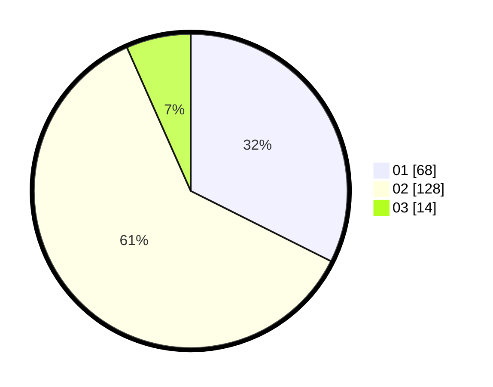

# Hasil

Hasil perolehan suara paslon dapat dilihat pada file paslon-01.txt, paslon-02.txt, dan paslon-03.txt.

Jika tidak ada, artinya data tersebut belum ada pada SIREKAP.

## Perolehan Suara

 * Paslon 01: **68**.
 * Paslon 02: **128**.
 * Paslon 03: **14**.

## Foto C Plano

https://sirekap-obj-formc.kpu.go.id/0e8f/pemilu/ppwp/31/75/06/10/03/3175061003209-20240214-155627--70a90183-9a39-431b-88d7-a0566c06c459.jpg

https://sirekap-obj-formc.kpu.go.id/0e8f/pemilu/ppwp/31/75/06/10/03/3175061003209-20240214-160121--78712f9c-09ba-44e2-8915-3d56a7d86812.jpg

https://sirekap-obj-formc.kpu.go.id/0e8f/pemilu/ppwp/31/75/06/10/03/3175061003209-20240214-160139--c758aee4-5126-4beb-a30a-ede096e2fc82.jpg

## DATA PEMILIH TETAP

Jumlah pemilih dalam DPT: **265**.
 * L: **138**.
 * P: **127**.

## DATA PENGGUNA HAK PILIH

Jumlah pengguna hak pilih dalam DPT: **212**.
 * L: **108**.
 * P: **104**.

Jumlah pengguna hak pilih dalam DPTb: **0**.
 * L: **0**.
 * P: **0**.

Jumlah pengguna hak pilih dalam DPK: **0**.
 * L: **0**.
 * P: **0**.

Jumlah pengguna hak pilih: **212**.
 * L: **108**.
 * P: **104**.

## JUMLAH SUARA SAH DAN TIDAK SAH

JUMLAH SELURUH SUARA SAH: **210**.

JUMLAH SUARA TIDAK SAH: **2**.

JUMLAH SELURUH SUARA SAH DAN SUARA TIDAK SAH: **212**.
