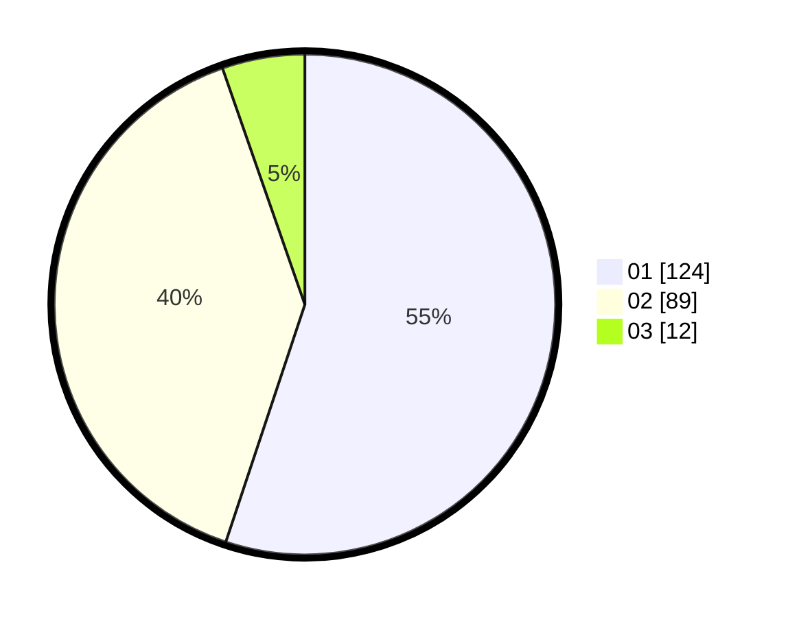

# Hasil

Hasil perolehan suara paslon dapat dilihat pada file paslon-01.txt, paslon-02.txt, dan paslon-03.txt.

Jika tidak ada, artinya data tersebut belum ada pada SIREKAP.

## Perolehan Suara

 * Paslon 01: **124**.
 * Paslon 02: **89**.
 * Paslon 03: **12**.

## Foto C Plano

https://sirekap-obj-formc.kpu.go.id/15f4/pemilu/ppwp/31/75/06/10/03/3175061003215-20240216-151954--215064b4-543e-476e-88e3-cb7bc92f6a12.jpg

https://sirekap-obj-formc.kpu.go.id/15f4/pemilu/ppwp/31/75/06/10/03/3175061003215-20240216-151955--9399181a-f0fe-49a8-af89-9d2b5005225a.jpg

https://sirekap-obj-formc.kpu.go.id/15f4/pemilu/ppwp/31/75/06/10/03/3175061003215-20240216-151954--d1655129-5fd2-44d9-8387-832c0ea87353.jpg

## DATA PEMILIH TETAP

Jumlah pemilih dalam DPT: **285**.
 * L: **147**.
 * P: **138**.

## DATA PENGGUNA HAK PILIH

Jumlah pengguna hak pilih dalam DPT: **227**.
 * L: **116**.
 * P: **111**.

Jumlah pengguna hak pilih dalam DPTb: **0**.
 * L: **0**.
 * P: **0**.

Jumlah pengguna hak pilih dalam DPK: **1**.
 * L: **0**.
 * P: **1**.

Jumlah pengguna hak pilih: **228**.
 * L: **116**.
 * P: **112**.

## JUMLAH SUARA SAH DAN TIDAK SAH

JUMLAH SELURUH SUARA SAH: **225**.

JUMLAH SUARA TIDAK SAH: **3**.

JUMLAH SELURUH SUARA SAH DAN SUARA TIDAK SAH: **228**.
