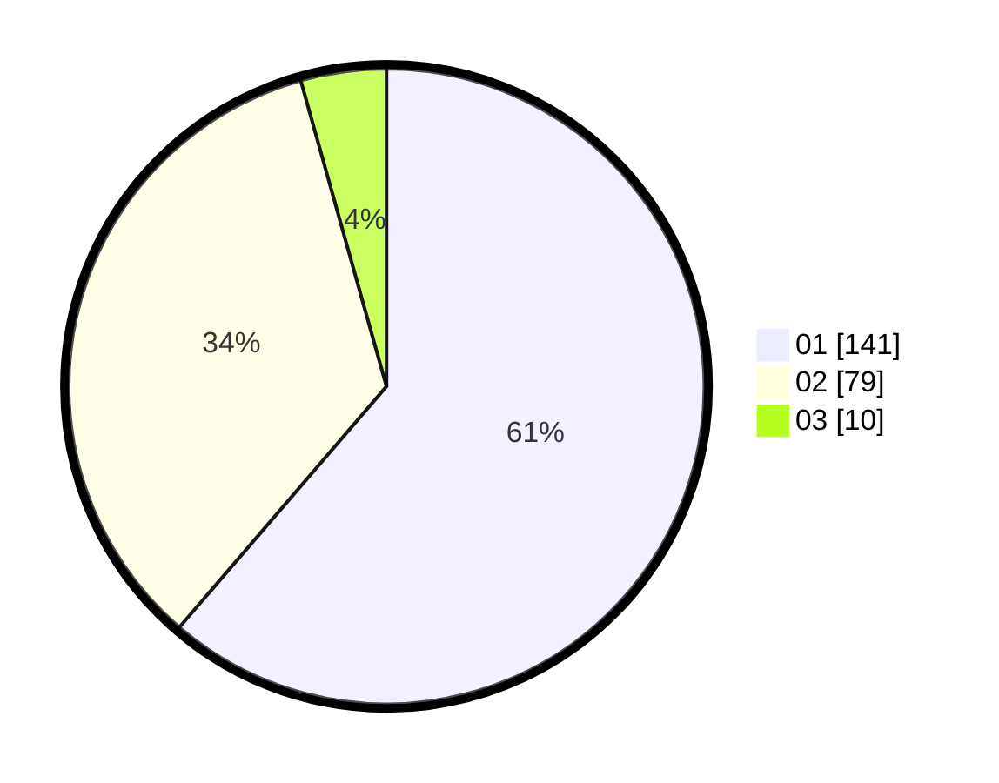

# Hasil

Hasil perolehan suara paslon dapat dilihat pada file paslon-01.txt, paslon-02.txt, dan paslon-03.txt.

Jika tidak ada, artinya data tersebut belum ada pada SIREKAP.

## Perolehan Suara

 * Paslon 01: **141**.
 * Paslon 02: **79**.
 * Paslon 03: **10**.

## Foto C Plano

https://sirekap-obj-formc.kpu.go.id/96c4/pemilu/ppwp/31/75/06/10/03/3175061003216-20240214-190523--4ec83d6b-a93d-4c09-b2ad-df232d87ea73.jpg

https://sirekap-obj-formc.kpu.go.id/96c4/pemilu/ppwp/31/75/06/10/03/3175061003216-20240214-190630--5678e866-4a3e-4194-a83d-70b8ed24b598.jpg

https://sirekap-obj-formc.kpu.go.id/96c4/pemilu/ppwp/31/75/06/10/03/3175061003216-20240214-190737--18a43b7f-fc96-4f3e-a018-4a1860d8189c.jpg
