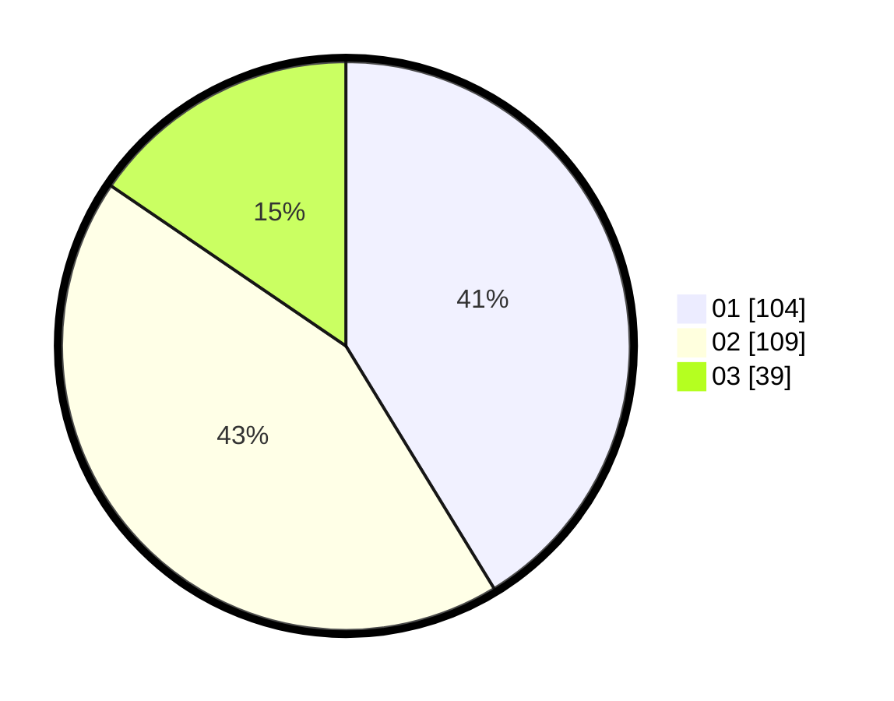

# Hasil

Hasil perolehan suara paslon dapat dilihat pada file paslon-01.txt, paslon-02.txt, dan paslon-03.txt.

Jika tidak ada, artinya data tersebut belum ada pada SIREKAP.

## Perolehan Suara

 * Paslon 01: **104**.
 * Paslon 02: **109**.
 * Paslon 03: **39**.

## Foto C Plano

https://sirekap-obj-formc.kpu.go.id/731a/pemilu/ppwp/31/75/06/10/03/3175061003222-20240214-223921--e591e412-2dc7-470f-a59b-250d6dd19605.jpg

https://sirekap-obj-formc.kpu.go.id/731a/pemilu/ppwp/31/75/06/10/03/3175061003222-20240214-212223--13a22b0a-08c9-4dc1-b208-95f491d149b7.jpg

https://sirekap-obj-formc.kpu.go.id/731a/pemilu/ppwp/31/75/06/10/03/3175061003222-20240214-223846--2d268fa4-8936-42f7-8d4a-d7d1ea2004c8.jpg

## DATA PEMILIH TETAP

Jumlah pemilih dalam DPT: **296**.
 * L: **136**.
 * P: **160**.

## DATA PENGGUNA HAK PILIH

Jumlah pengguna hak pilih dalam DPT: **241**.
 * L: **103**.
 * P: **138**.

Jumlah pengguna hak pilih dalam DPTb: **0**.
 * L: **0**.
 * P: **0**.

Jumlah pengguna hak pilih dalam DPK: **12**.
 * L: **6**.
 * P: **6**.

Jumlah pengguna hak pilih: **253**.
 * L: **109**.
 * P: **144**.

## JUMLAH SUARA SAH DAN TIDAK SAH

JUMLAH SELURUH SUARA SAH: **252**.

JUMLAH SUARA TIDAK SAH: **1**.

JUMLAH SELURUH SUARA SAH DAN SUARA TIDAK SAH: **253**.
