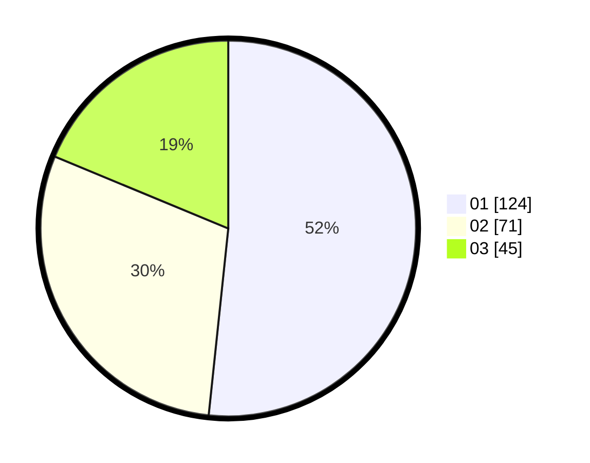

# Hasil

Hasil perolehan suara paslon dapat dilihat pada file paslon-01.txt, paslon-02.txt, dan paslon-03.txt.

Jika tidak ada, artinya data tersebut belum ada pada SIREKAP.

## Perolehan Suara

 * Paslon 01: **124**.
 * Paslon 02: **71**.
 * Paslon 03: **45**.

## Foto C Plano

https://sirekap-obj-formc.kpu.go.id/9b56/pemilu/ppwp/31/75/06/10/03/3175061003225-20240215-001635--ba003a11-ef83-4298-ac5b-bd36c3765358.jpg

https://sirekap-obj-formc.kpu.go.id/9b56/pemilu/ppwp/31/75/06/10/03/3175061003225-20240215-001641--a69ff39d-6a78-4fde-bb66-5fbf41623ad0.jpg

https://sirekap-obj-formc.kpu.go.id/9b56/pemilu/ppwp/31/75/06/10/03/3175061003225-20240215-001922--64b06210-cb7b-4c29-8226-fdf472f0cbd6.jpg
