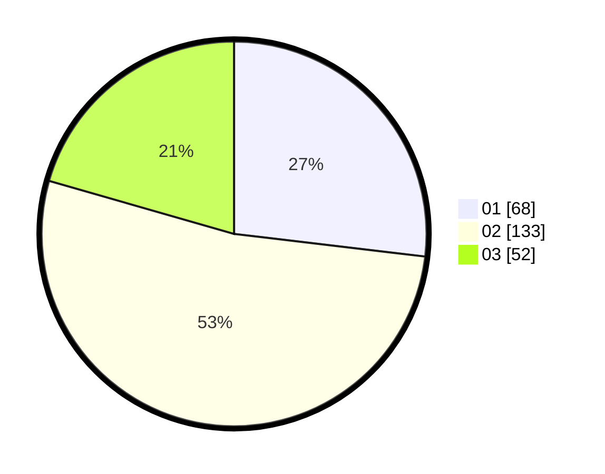

# Hasil

Hasil perolehan suara paslon dapat dilihat pada file paslon-01.txt, paslon-02.txt, dan paslon-03.txt.

Jika tidak ada, artinya data tersebut belum ada pada SIREKAP.

## Perolehan Suara

 * Paslon 01: **68**.
 * Paslon 02: **133**.
 * Paslon 03: **52**.

## Foto C Plano

https://sirekap-obj-formc.kpu.go.id/a6a0/pemilu/ppwp/31/75/06/10/03/3175061003230-20240214-162239--5f54d48e-9977-46f3-beb5-8cfb687fd776.jpg

https://sirekap-obj-formc.kpu.go.id/a6a0/pemilu/ppwp/31/75/06/10/03/3175061003230-20240214-215038--29f262a7-03ca-4787-aa5e-8069403f87c6.jpg
