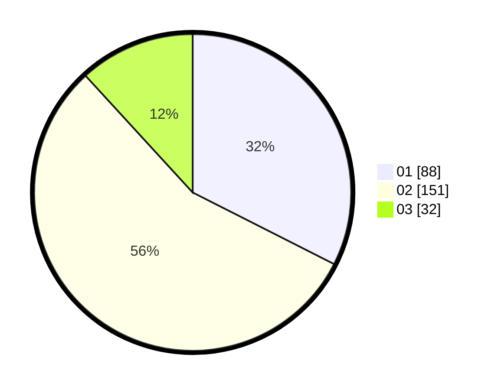

# Hasil

Hasil perolehan suara paslon dapat dilihat pada file paslon-01.txt, paslon-02.txt, dan paslon-03.txt.

Jika tidak ada, artinya data tersebut belum ada pada SIREKAP.

## Perolehan Suara

 * Paslon 01: **88**.
 * Paslon 02: **151**.
 * Paslon 03: **32**.

## Foto C Plano

https://sirekap-obj-formc.kpu.go.id/064d/pemilu/ppwp/31/75/06/10/03/3175061003235-20240216-021240--1e8d5637-4fdf-4842-bdcd-daebbd871fd9.jpg

https://sirekap-obj-formc.kpu.go.id/064d/pemilu/ppwp/31/75/06/10/03/3175061003235-20240216-021250--4d1f01f3-3db3-4515-a99b-2e22717e83ac.jpg

https://sirekap-obj-formc.kpu.go.id/064d/pemilu/ppwp/31/75/06/10/03/3175061003235-20240216-021247--832f00ad-94d4-4366-b725-6b1a714f9ba5.jpg

## DATA PEMILIH TETAP

Jumlah pemilih dalam DPT: **0**.
 * L: **0**.
 * P: **0**.

## DATA PENGGUNA HAK PILIH

Jumlah pengguna hak pilih dalam DPT: **0**.
 * L: **0**.
 * P: **0**.

Jumlah pengguna hak pilih dalam DPTb: **0**.
 * L: **0**.
 * P: **0**.

Jumlah pengguna hak pilih dalam DPK: **0**.
 * L: **0**.
 * P: **0**.

Jumlah pengguna hak pilih: **0**.
 * L: **0**.
 * P: **0**.

## JUMLAH SUARA SAH DAN TIDAK SAH

JUMLAH SELURUH SUARA SAH: **271**.

JUMLAH SUARA TIDAK SAH: **5**.

JUMLAH SELURUH SUARA SAH DAN SUARA TIDAK SAH: **276**.
