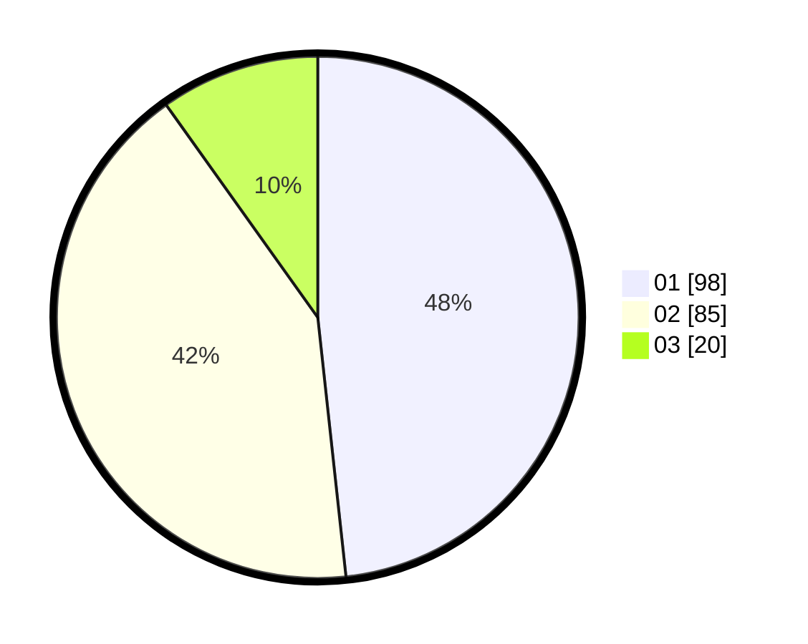

# Hasil

Hasil perolehan suara paslon dapat dilihat pada file paslon-01.txt, paslon-02.txt, dan paslon-03.txt.

Jika tidak ada, artinya data tersebut belum ada pada SIREKAP.

## Perolehan Suara

 * Paslon 01: **98**.
 * Paslon 02: **85**.
 * Paslon 03: **20**.

## Foto C Plano

https://sirekap-obj-formc.kpu.go.id/c2ed/pemilu/ppwp/31/75/06/10/03/3175061003244-20240214-230903--a7c70f1f-2a92-4f54-851a-12f6bb572154.jpg

https://sirekap-obj-formc.kpu.go.id/c2ed/pemilu/ppwp/31/75/06/10/03/3175061003244-20240214-230909--7604bc1f-a11f-4a54-b7c7-99f9e080cf7d.jpg

https://sirekap-obj-formc.kpu.go.id/c2ed/pemilu/ppwp/31/75/06/10/03/3175061003244-20240214-230918--db4f4d7f-8c49-4f56-adbf-bcf0f1e73304.jpg

## DATA PEMILIH TETAP

Jumlah pemilih dalam DPT: **243**.
 * L: **124**.
 * P: **119**.

## DATA PENGGUNA HAK PILIH

Jumlah pengguna hak pilih dalam DPT: **200**.
 * L: **101**.
 * P: **99**.

Jumlah pengguna hak pilih dalam DPTb: **0**.
 * L: **0**.
 * P: **0**.

Jumlah pengguna hak pilih dalam DPK: **3**.
 * L: **1**.
 * P: **2**.

Jumlah pengguna hak pilih: **203**.
 * L: **102**.
 * P: **101**.

## JUMLAH SUARA SAH DAN TIDAK SAH

JUMLAH SELURUH SUARA SAH: **203**.

JUMLAH SUARA TIDAK SAH: **0**.

JUMLAH SELURUH SUARA SAH DAN SUARA TIDAK SAH: **203**.
