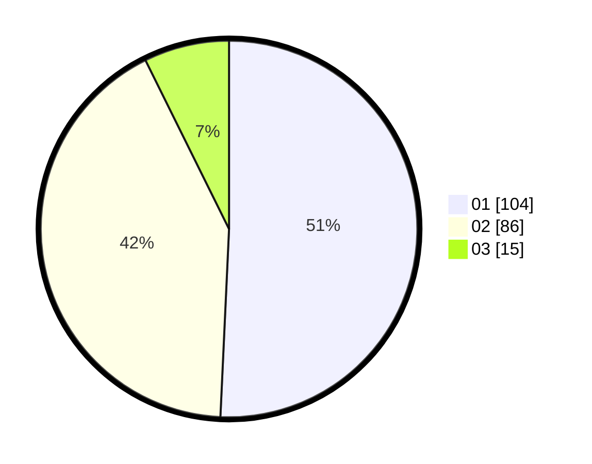

# Hasil

Hasil perolehan suara paslon dapat dilihat pada file paslon-01.txt, paslon-02.txt, dan paslon-03.txt.

Jika tidak ada, artinya data tersebut belum ada pada SIREKAP.

## Perolehan Suara

 * Paslon 01: **104**.
 * Paslon 02: **86**.
 * Paslon 03: **15**.

## Foto C Plano

https://sirekap-obj-formc.kpu.go.id/4949/pemilu/ppwp/31/75/06/10/03/3175061003256-20240214-200648--e0ce9e76-e37d-43df-995a-d8fc2a83a2dc.jpg

https://sirekap-obj-formc.kpu.go.id/4949/pemilu/ppwp/31/75/06/10/03/3175061003256-20240214-200657--5f18cb49-de14-468f-892c-3bcb1570955f.jpg

https://sirekap-obj-formc.kpu.go.id/4949/pemilu/ppwp/31/75/06/10/03/3175061003256-20240214-200702--f35fc2e3-a5dc-47d0-9819-1e3af9284077.jpg

## DATA PEMILIH TETAP

Jumlah pemilih dalam DPT: **253**.
 * L: **134**.
 * P: **119**.

## DATA PENGGUNA HAK PILIH

Jumlah pengguna hak pilih dalam DPT: **205**.
 * L: **100**.
 * P: **105**.

Jumlah pengguna hak pilih dalam DPTb: **0**.
 * L: **0**.
 * P: **0**.

Jumlah pengguna hak pilih dalam DPK: **4**.
 * L: **2**.
 * P: **2**.

Jumlah pengguna hak pilih: **209**.
 * L: **102**.
 * P: **107**.

## JUMLAH SUARA SAH DAN TIDAK SAH

JUMLAH SELURUH SUARA SAH: **205**.

JUMLAH SUARA TIDAK SAH: **6**.

JUMLAH SELURUH SUARA SAH DAN SUARA TIDAK SAH: **211**.
