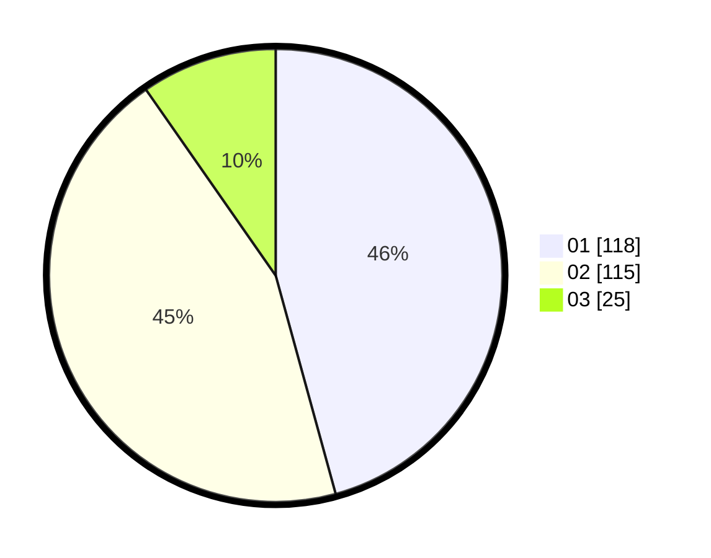

# Hasil

Hasil perolehan suara paslon dapat dilihat pada file paslon-01.txt, paslon-02.txt, dan paslon-03.txt.

Jika tidak ada, artinya data tersebut belum ada pada SIREKAP.

## Perolehan Suara

 * Paslon 01: **118**.
 * Paslon 02: **115**.
 * Paslon 03: **25**.

## Foto C Plano

https://sirekap-obj-formc.kpu.go.id/0e09/pemilu/ppwp/31/75/06/10/03/3175061003257-20240214-212003--a87b0cf6-c247-4162-9eaa-3a457c3fef42.jpg

https://sirekap-obj-formc.kpu.go.id/0e09/pemilu/ppwp/31/75/06/10/03/3175061003257-20240214-211712--78e9a2f2-b002-4a11-bca1-f982cf7b6e17.jpg

https://sirekap-obj-formc.kpu.go.id/0e09/pemilu/ppwp/31/75/06/10/03/3175061003257-20240214-220019--7d487010-e33a-4ec9-a47e-87e1e1f34b7d.jpg
