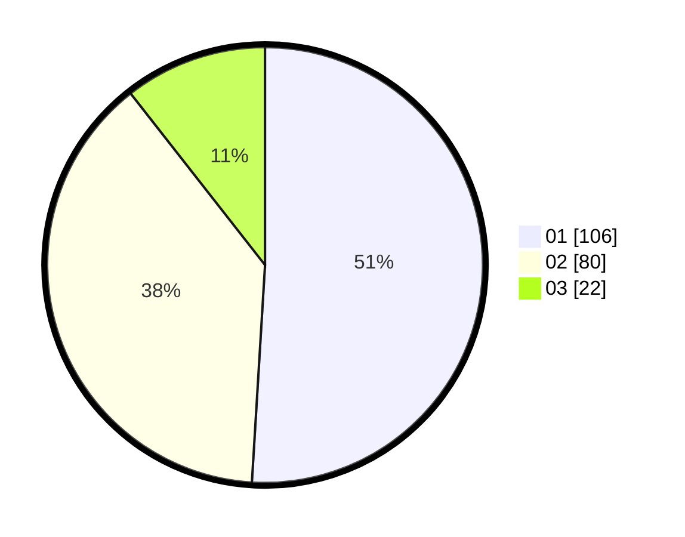

# Hasil

Hasil perolehan suara paslon dapat dilihat pada file paslon-01.txt, paslon-02.txt, dan paslon-03.txt.

Jika tidak ada, artinya data tersebut belum ada pada SIREKAP.

## Perolehan Suara

 * Paslon 01: **106**.
 * Paslon 02: **80**.
 * Paslon 03: **22**.

## Foto C Plano

https://sirekap-obj-formc.kpu.go.id/bbfb/pemilu/ppwp/31/75/06/10/03/3175061003260-20240214-212310--160d09dc-09af-4537-ac7f-2e4df992eb7d.jpg

https://sirekap-obj-formc.kpu.go.id/bbfb/pemilu/ppwp/31/75/06/10/03/3175061003260-20240214-212222--aba6b78c-583b-4a46-928b-8256cdb56813.jpg
