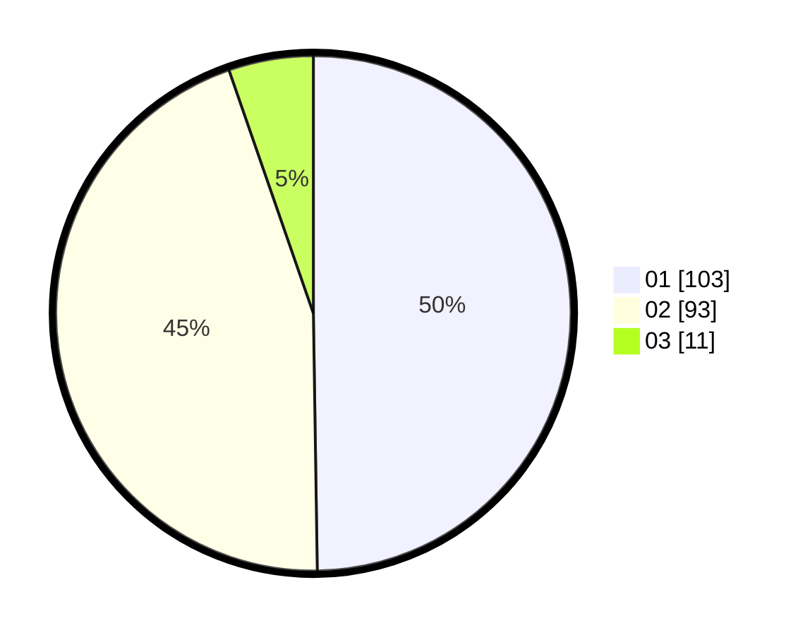

# Hasil

Hasil perolehan suara paslon dapat dilihat pada file paslon-01.txt, paslon-02.txt, dan paslon-03.txt.

Jika tidak ada, artinya data tersebut belum ada pada SIREKAP.

## Perolehan Suara

 * Paslon 01: **103**.
 * Paslon 02: **93**.
 * Paslon 03: **11**.

## Foto C Plano

https://sirekap-obj-formc.kpu.go.id/b5da/pemilu/ppwp/31/75/06/10/03/3175061003262-20240214-220722--1e022456-28fd-476b-9123-f7b29a15d16f.jpg

https://sirekap-obj-formc.kpu.go.id/b5da/pemilu/ppwp/31/75/06/10/03/3175061003262-20240214-221051--6443cfeb-d0be-4aca-9901-88bc7d82e401.jpg

https://sirekap-obj-formc.kpu.go.id/b5da/pemilu/ppwp/31/75/06/10/03/3175061003262-20240214-221156--52d995cf-b61d-4dc1-b551-60553c0eb1ea.jpg
