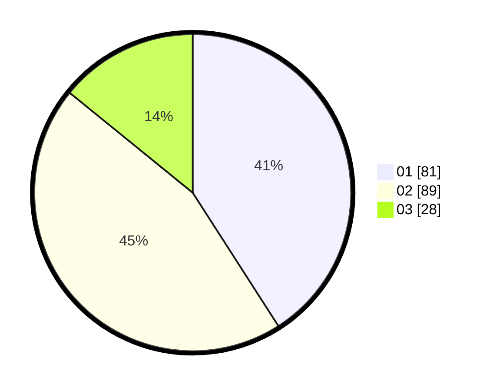

# Hasil

Hasil perolehan suara paslon dapat dilihat pada file paslon-01.txt, paslon-02.txt, dan paslon-03.txt.

Jika tidak ada, artinya data tersebut belum ada pada SIREKAP.

## Perolehan Suara

 * Paslon 01: **81**.
 * Paslon 02: **89**.
 * Paslon 03: **28**.

## Foto C Plano

https://sirekap-obj-formc.kpu.go.id/82aa/pemilu/ppwp/31/75/06/10/03/3175061003265-20240214-222238--4c27d4b8-99e3-4547-912c-804e6fe33f70.jpg

https://sirekap-obj-formc.kpu.go.id/82aa/pemilu/ppwp/31/75/06/10/03/3175061003265-20240214-222500--a0e8e578-6b97-4d28-a09f-d2812e0bdc2a.jpg
