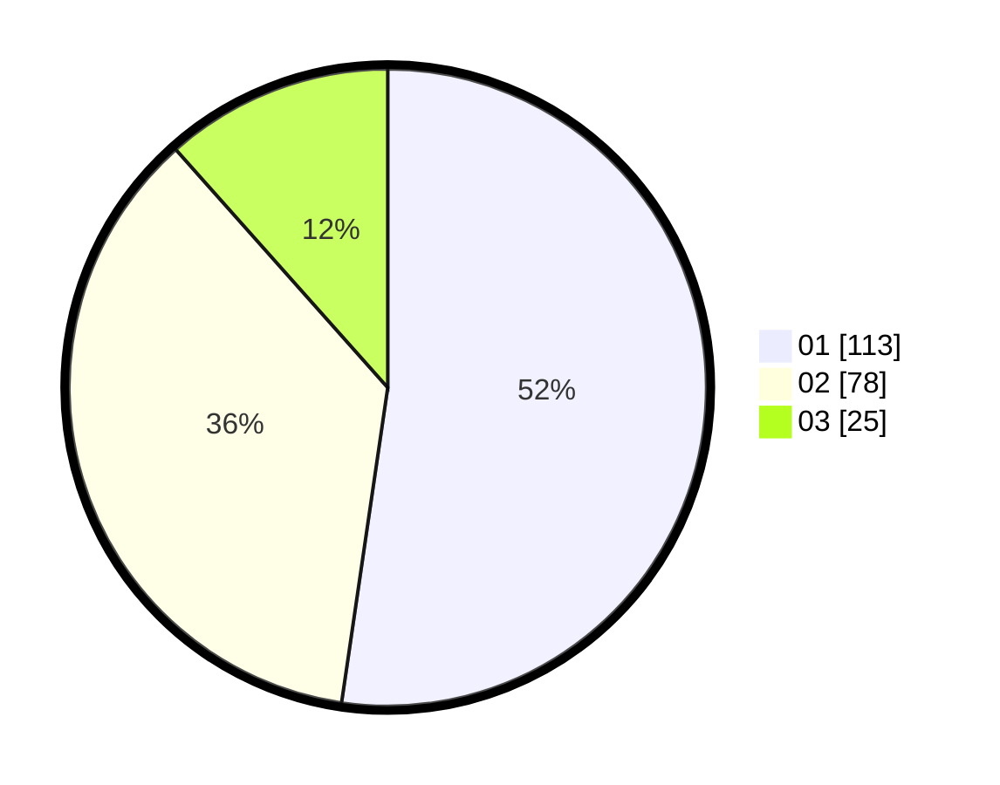

# Hasil

Hasil perolehan suara paslon dapat dilihat pada file paslon-01.txt, paslon-02.txt, dan paslon-03.txt.

Jika tidak ada, artinya data tersebut belum ada pada SIREKAP.

## Perolehan Suara

 * Paslon 01: **113**.
 * Paslon 02: **78**.
 * Paslon 03: **25**.

## Foto C Plano

https://sirekap-obj-formc.kpu.go.id/db73/pemilu/ppwp/31/75/06/10/03/3175061003266-20240214-210032--00c0e7af-990d-45ff-b711-92dbe70556db.jpg

https://sirekap-obj-formc.kpu.go.id/db73/pemilu/ppwp/31/75/06/10/03/3175061003266-20240214-210159--3c9e5098-c23f-4486-a583-a250381bc0a4.jpg

https://sirekap-obj-formc.kpu.go.id/db73/pemilu/ppwp/31/75/06/10/03/3175061003266-20240214-210354--02899f44-02b9-4adb-9cde-102e05bed49c.jpg
