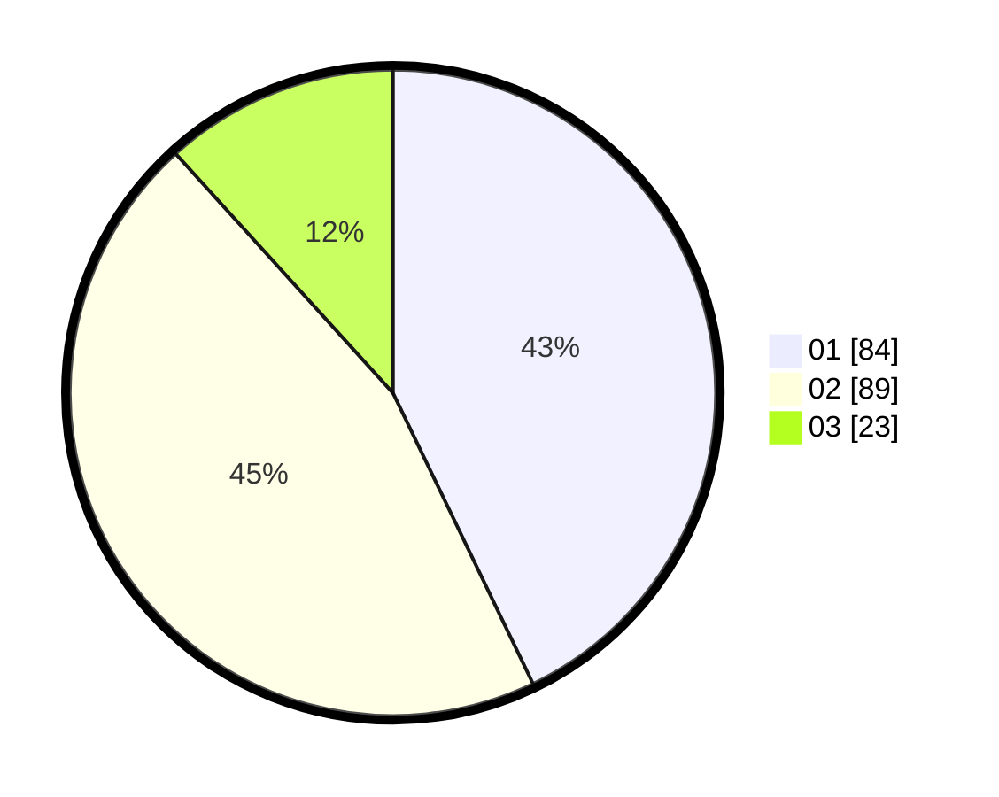

# Hasil

Hasil perolehan suara paslon dapat dilihat pada file paslon-01.txt, paslon-02.txt, dan paslon-03.txt.

Jika tidak ada, artinya data tersebut belum ada pada SIREKAP.

## Perolehan Suara

 * Paslon 01: **84**.
 * Paslon 02: **89**.
 * Paslon 03: **23**.

## Foto C Plano

https://sirekap-obj-formc.kpu.go.id/1314/pemilu/ppwp/31/75/06/10/03/3175061003269-20240214-195210--14e5d15e-7ab6-453b-825c-2b103b3ddb0c.jpg

https://sirekap-obj-formc.kpu.go.id/1314/pemilu/ppwp/31/75/06/10/03/3175061003269-20240214-201955--d23835de-efb1-4811-bc45-198b2af3cda4.jpg

https://sirekap-obj-formc.kpu.go.id/1314/pemilu/ppwp/31/75/06/10/03/3175061003269-20240214-202246--558888a5-c639-49b8-8732-99cfb7e6d698.jpg

## DATA PEMILIH TETAP

Jumlah pemilih dalam DPT: **245**.
 * L: **111**.
 * P: **134**.

## DATA PENGGUNA HAK PILIH

Jumlah pengguna hak pilih dalam DPT: **198**.
 * L: **83**.
 * P: **115**.

Jumlah pengguna hak pilih dalam DPTb: **0**.
 * L: **0**.
 * P: **0**.

Jumlah pengguna hak pilih dalam DPK: **0**.
 * L: **0**.
 * P: **0**.

Jumlah pengguna hak pilih: **198**.
 * L: **83**.
 * P: **115**.

## JUMLAH SUARA SAH DAN TIDAK SAH

JUMLAH SELURUH SUARA SAH: **196**.

JUMLAH SUARA TIDAK SAH: **2**.

JUMLAH SELURUH SUARA SAH DAN SUARA TIDAK SAH: **198**.
