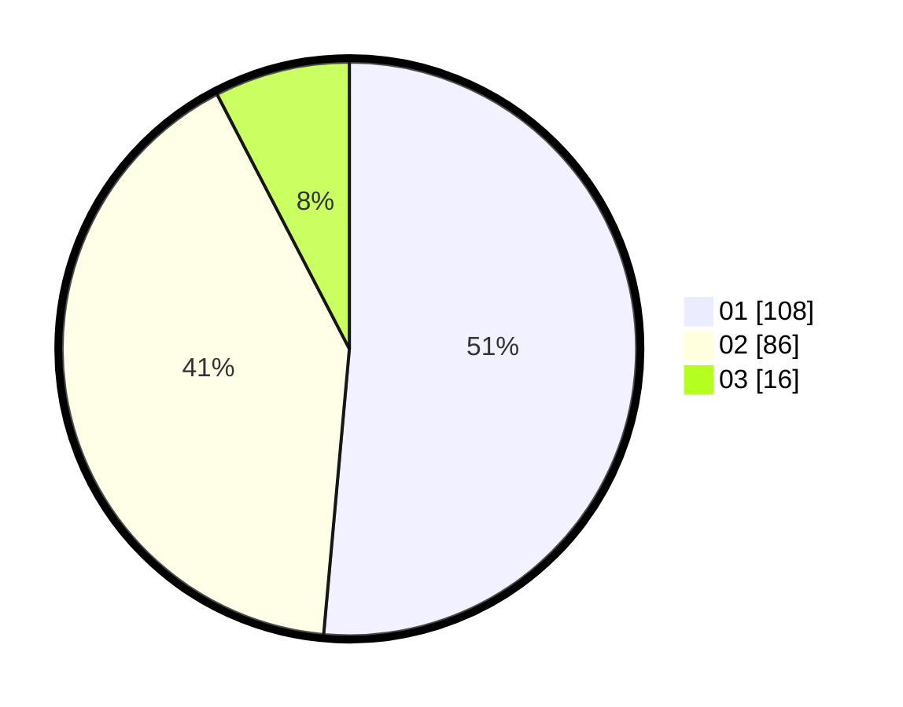

# Hasil

Hasil perolehan suara paslon dapat dilihat pada file paslon-01.txt, paslon-02.txt, dan paslon-03.txt.

Jika tidak ada, artinya data tersebut belum ada pada SIREKAP.

## Perolehan Suara

 * Paslon 01: **108**.
 * Paslon 02: **86**.
 * Paslon 03: **16**.

## Foto C Plano

https://sirekap-obj-formc.kpu.go.id/f271/pemilu/ppwp/31/75/06/10/03/3175061003271-20240214-220504--f5fc6a78-e7ab-4ce1-8693-85f313250aac.jpg

https://sirekap-obj-formc.kpu.go.id/f271/pemilu/ppwp/31/75/06/10/03/3175061003271-20240214-220528--b8f8999f-e6a7-47af-a33a-f3219c7e971a.jpg

https://sirekap-obj-formc.kpu.go.id/f271/pemilu/ppwp/31/75/06/10/03/3175061003271-20240214-212613--42fafb97-71ec-457c-91ec-baa8f3fd31a8.jpg

## DATA PEMILIH TETAP

Jumlah pemilih dalam DPT: **258**.
 * L: **133**.
 * P: **125**.

## DATA PENGGUNA HAK PILIH

Jumlah pengguna hak pilih dalam DPT: **208**.
 * L: **102**.
 * P: **106**.

Jumlah pengguna hak pilih dalam DPTb: **2**.
 * L: **1**.
 * P: **1**.

Jumlah pengguna hak pilih dalam DPK: **1**.
 * L: **0**.
 * P: **1**.

Jumlah pengguna hak pilih: **211**.
 * L: **103**.
 * P: **108**.

## JUMLAH SUARA SAH DAN TIDAK SAH

JUMLAH SELURUH SUARA SAH: **210**.

JUMLAH SUARA TIDAK SAH: **1**.

JUMLAH SELURUH SUARA SAH DAN SUARA TIDAK SAH: **211**.
