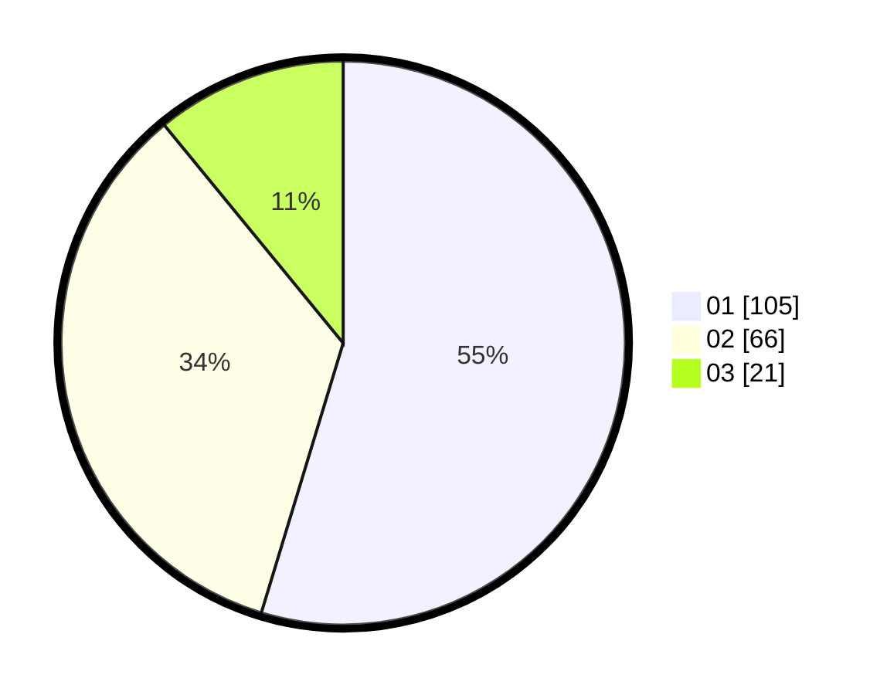

# Hasil

Hasil perolehan suara paslon dapat dilihat pada file paslon-01.txt, paslon-02.txt, dan paslon-03.txt.

Jika tidak ada, artinya data tersebut belum ada pada SIREKAP.

## Perolehan Suara

 * Paslon 01: **105**.
 * Paslon 02: **66**.
 * Paslon 03: **21**.

## Foto C Plano

https://sirekap-obj-formc.kpu.go.id/266b/pemilu/ppwp/31/75/06/10/03/3175061003278-20240216-150548--349b6cee-5ba1-4b0e-aa47-59773b4dbd96.jpg

https://sirekap-obj-formc.kpu.go.id/266b/pemilu/ppwp/31/75/06/10/03/3175061003278-20240216-150550--dd317ea5-50ba-44c4-9009-54204942733d.jpg

https://sirekap-obj-formc.kpu.go.id/266b/pemilu/ppwp/31/75/06/10/03/3175061003278-20240216-150549--ee3b0062-0cea-46bf-8082-fa757b10e703.jpg

## DATA PEMILIH TETAP

Jumlah pemilih dalam DPT: **254**.
 * L: **126**.
 * P: **128**.

## DATA PENGGUNA HAK PILIH

Jumlah pengguna hak pilih dalam DPT: **194**.
 * L: **95**.
 * P: **99**.

Jumlah pengguna hak pilih dalam DPTb: **1**.
 * L: **1**.
 * P: **0**.

Jumlah pengguna hak pilih dalam DPK: **0**.
 * L: **0**.
 * P: **0**.

Jumlah pengguna hak pilih: **195**.
 * L: **96**.
 * P: **99**.

## JUMLAH SUARA SAH DAN TIDAK SAH

JUMLAH SELURUH SUARA SAH: **192**.

JUMLAH SUARA TIDAK SAH: **3**.

JUMLAH SELURUH SUARA SAH DAN SUARA TIDAK SAH: **195**.
