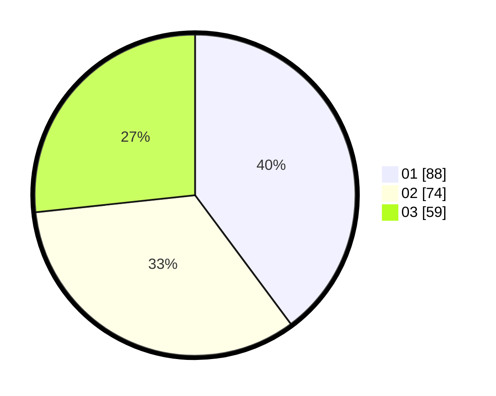

# Hasil

Hasil perolehan suara paslon dapat dilihat pada file paslon-01.txt, paslon-02.txt, dan paslon-03.txt.

Jika tidak ada, artinya data tersebut belum ada pada SIREKAP.

## Perolehan Suara

 * Paslon 01: **88**.
 * Paslon 02: **74**.
 * Paslon 03: **59**.

## Foto C Plano

https://sirekap-obj-formc.kpu.go.id/14a6/pemilu/ppwp/31/75/06/10/03/3175061003285-20240216-144258--02aac59f-fef1-40d1-b1e0-a61ec16881cb.jpg

https://sirekap-obj-formc.kpu.go.id/14a6/pemilu/ppwp/31/75/06/10/03/3175061003285-20240216-144259--619fd135-f3e2-414f-9291-19e45131274f.jpg

https://sirekap-obj-formc.kpu.go.id/14a6/pemilu/ppwp/31/75/06/10/03/3175061003285-20240216-144259--bc410e95-4ef5-4dbd-8633-876c1cf9a6de.jpg

## DATA PEMILIH TETAP

Jumlah pemilih dalam DPT: **248**.
 * L: **119**.
 * P: **129**.

## DATA PENGGUNA HAK PILIH

Jumlah pengguna hak pilih dalam DPT: **216**.
 * L: **100**.
 * P: **116**.

Jumlah pengguna hak pilih dalam DPTb: **4**.
 * L: **1**.
 * P: **3**.

Jumlah pengguna hak pilih dalam DPK: **4**.
 * L: **2**.
 * P: **2**.

Jumlah pengguna hak pilih: **224**.
 * L: **103**.
 * P: **121**.

## JUMLAH SUARA SAH DAN TIDAK SAH

JUMLAH SELURUH SUARA SAH: **221**.

JUMLAH SUARA TIDAK SAH: **3**.

JUMLAH SELURUH SUARA SAH DAN SUARA TIDAK SAH: **224**.
