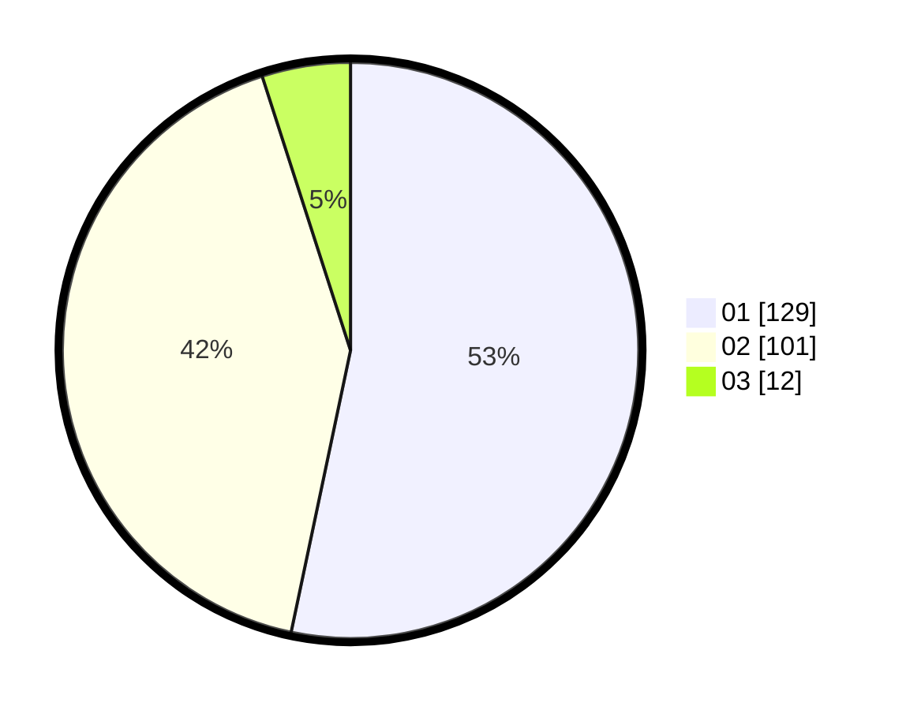

# Hasil

Hasil perolehan suara paslon dapat dilihat pada file paslon-01.txt, paslon-02.txt, dan paslon-03.txt.

Jika tidak ada, artinya data tersebut belum ada pada SIREKAP.

## Perolehan Suara

 * Paslon 01: **129**.
 * Paslon 02: **101**.
 * Paslon 03: **12**.

## Foto C Plano

https://sirekap-obj-formc.kpu.go.id/c305/pemilu/ppwp/31/75/06/10/03/3175061003293-20240214-215034--0a700b31-106b-4202-9eb6-421f1769760d.jpg

https://sirekap-obj-formc.kpu.go.id/c305/pemilu/ppwp/31/75/06/10/03/3175061003293-20240214-215226--4ce54f4c-8dd1-49bd-949a-13e9fce8e2b8.jpg

https://sirekap-obj-formc.kpu.go.id/c305/pemilu/ppwp/31/75/06/10/03/3175061003293-20240214-215321--5aa947fb-8ba3-488a-8df0-e62886723087.jpg
