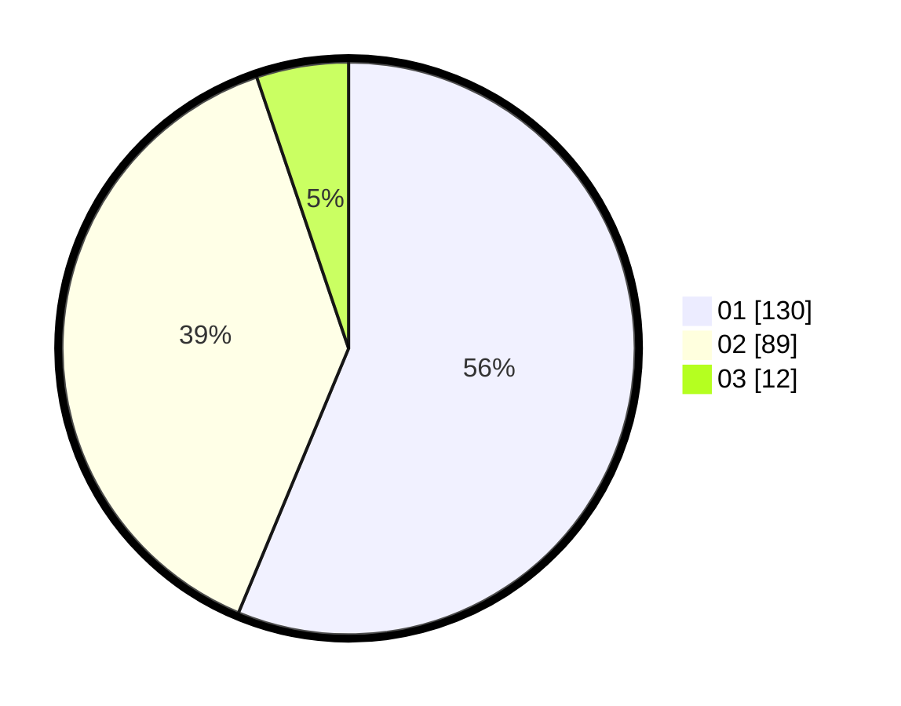

# Hasil

Hasil perolehan suara paslon dapat dilihat pada file paslon-01.txt, paslon-02.txt, dan paslon-03.txt.

Jika tidak ada, artinya data tersebut belum ada pada SIREKAP.

## Perolehan Suara

 * Paslon 01: **130**.
 * Paslon 02: **89**.
 * Paslon 03: **12**.

## Foto C Plano

https://sirekap-obj-formc.kpu.go.id/81ea/pemilu/ppwp/31/75/06/10/03/3175061003304-20240214-155231--7a2c5c18-eb6c-40b0-82bc-e7d3d220fd33.jpg

https://sirekap-obj-formc.kpu.go.id/81ea/pemilu/ppwp/31/75/06/10/03/3175061003304-20240214-155047--f98179df-c070-4c4e-bec0-4744442b0d99.jpg

https://sirekap-obj-formc.kpu.go.id/81ea/pemilu/ppwp/31/75/06/10/03/3175061003304-20240214-155651--9c47aa7c-d322-4dbb-bbd3-a67e8fa117cf.jpg
