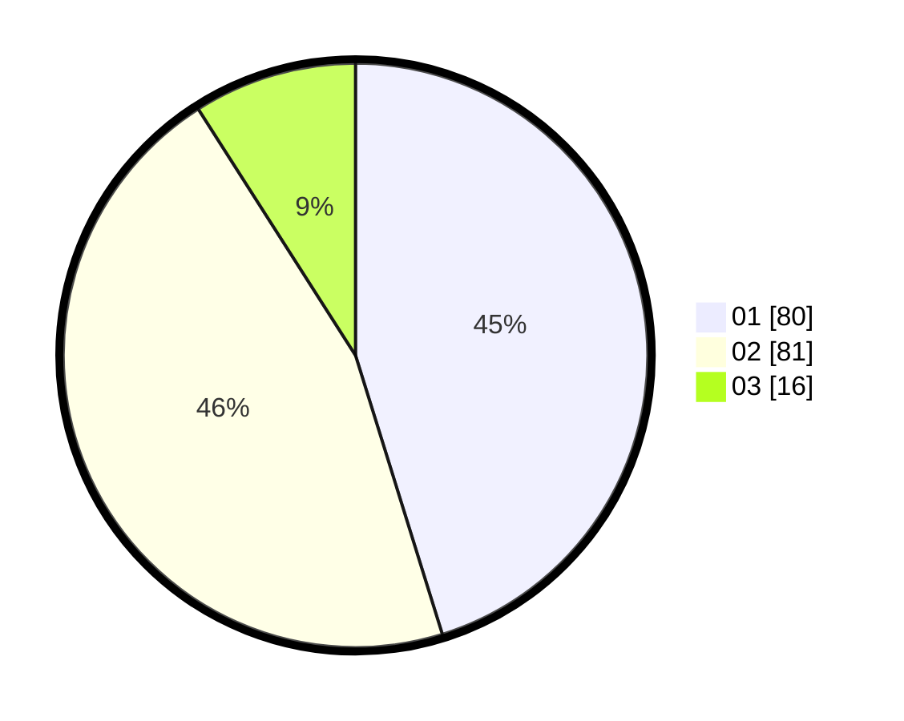

# Hasil

Hasil perolehan suara paslon dapat dilihat pada file paslon-01.txt, paslon-02.txt, dan paslon-03.txt.

Jika tidak ada, artinya data tersebut belum ada pada SIREKAP.

## Perolehan Suara

 * Paslon 01: **80**.
 * Paslon 02: **81**.
 * Paslon 03: **16**.

## Foto C Plano

https://sirekap-obj-formc.kpu.go.id/8f51/pemilu/ppwp/31/75/06/10/03/3175061003307-20240216-175851--d8df3d0d-5c42-40f6-8623-4dd413ab738c.jpg

https://sirekap-obj-formc.kpu.go.id/8f51/pemilu/ppwp/31/75/06/10/03/3175061003307-20240216-014114--7e12da7f-a65b-4cfa-b8a3-c5d721626ef5.jpg

https://sirekap-obj-formc.kpu.go.id/8f51/pemilu/ppwp/31/75/06/10/03/3175061003307-20240216-014108--6d4b3df7-c28c-4a38-84a1-f527cbfd12b2.jpg

## DATA PEMILIH TETAP

Jumlah pemilih dalam DPT: **174**.
 * L: **84**.
 * P: **90**.

## DATA PENGGUNA HAK PILIH

Jumlah pengguna hak pilih dalam DPT: **174**.
 * L: **84**.
 * P: **90**.

Jumlah pengguna hak pilih dalam DPTb: **0**.
 * L: **0**.
 * P: **0**.

Jumlah pengguna hak pilih dalam DPK: **3**.
 * L: **1**.
 * P: **2**.

Jumlah pengguna hak pilih: **177**.
 * L: **85**.
 * P: **92**.

## JUMLAH SUARA SAH DAN TIDAK SAH

JUMLAH SELURUH SUARA SAH: **177**.

JUMLAH SUARA TIDAK SAH: **0**.

JUMLAH SELURUH SUARA SAH DAN SUARA TIDAK SAH: **177**.
