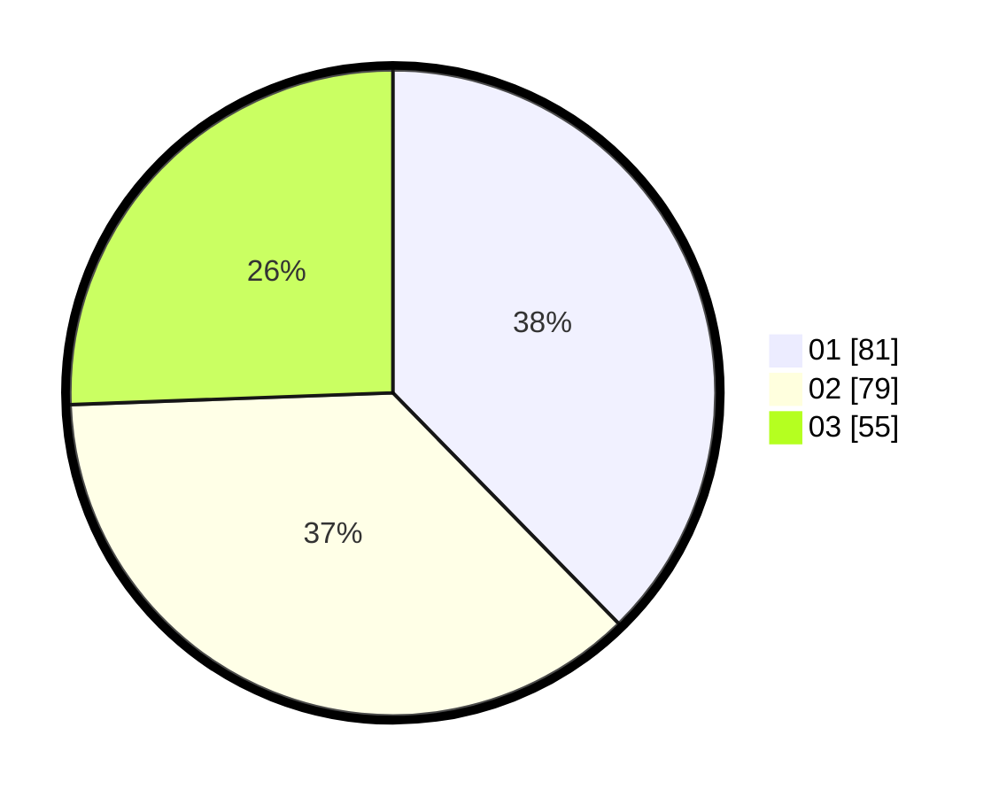

# Hasil

Hasil perolehan suara paslon dapat dilihat pada file paslon-01.txt, paslon-02.txt, dan paslon-03.txt.

Jika tidak ada, artinya data tersebut belum ada pada SIREKAP.

## Perolehan Suara

 * Paslon 01: **81**.
 * Paslon 02: **79**.
 * Paslon 03: **55**.

## Foto C Plano

https://sirekap-obj-formc.kpu.go.id/4076/pemilu/ppwp/31/75/06/10/03/3175061003309-20240214-160113--a5104df1-878a-41f3-b0b2-1e92ab968292.jpg

https://sirekap-obj-formc.kpu.go.id/4076/pemilu/ppwp/31/75/06/10/03/3175061003309-20240214-160105--8f8bf686-adf1-49a1-960d-97a8dd4dbc02.jpg

https://sirekap-obj-formc.kpu.go.id/4076/pemilu/ppwp/31/75/06/10/03/3175061003309-20240214-160156--2f43a01f-1b6a-4a0b-b51a-d7f37c570804.jpg
