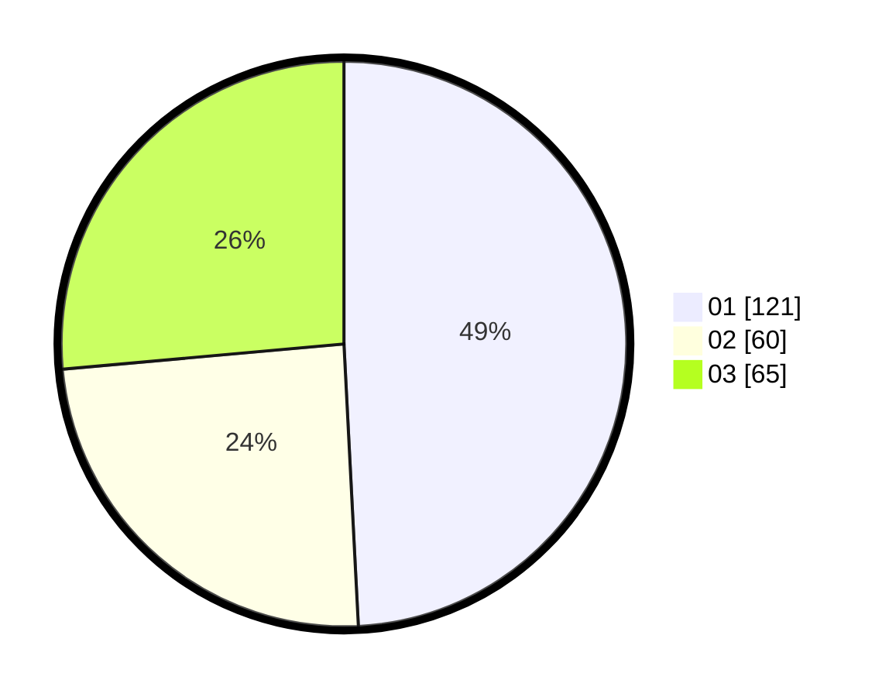

# Hasil

Hasil perolehan suara paslon dapat dilihat pada file paslon-01.txt, paslon-02.txt, dan paslon-03.txt.

Jika tidak ada, artinya data tersebut belum ada pada SIREKAP.

## Perolehan Suara

 * Paslon 01: **121**.
 * Paslon 02: **60**.
 * Paslon 03: **65**.

## Foto C Plano

https://sirekap-obj-formc.kpu.go.id/ad71/pemilu/ppwp/31/75/06/10/03/3175061003312-20240214-220047--04334392-f8ef-4c55-b4ed-e2093d619d12.jpg

https://sirekap-obj-formc.kpu.go.id/ad71/pemilu/ppwp/31/75/06/10/03/3175061003312-20240214-220057--ca05226a-8be8-4709-b505-274a220c7835.jpg

https://sirekap-obj-formc.kpu.go.id/ad71/pemilu/ppwp/31/75/06/10/03/3175061003312-20240214-220134--4208d656-f033-48e9-ba8b-5433b28d189d.jpg

## DATA PEMILIH TETAP

Jumlah pemilih dalam DPT: **278**.
 * L: **123**.
 * P: **155**.

## DATA PENGGUNA HAK PILIH

Jumlah pengguna hak pilih dalam DPT: **239**.
 * L: **103**.
 * P: **136**.

Jumlah pengguna hak pilih dalam DPTb: **4**.
 * L: **1**.
 * P: **3**.

Jumlah pengguna hak pilih dalam DPK: **4**.
 * L: **3**.
 * P: **1**.

Jumlah pengguna hak pilih: **247**.
 * L: **107**.
 * P: **140**.

## JUMLAH SUARA SAH DAN TIDAK SAH

JUMLAH SELURUH SUARA SAH: **246**.

JUMLAH SUARA TIDAK SAH: **1**.

JUMLAH SELURUH SUARA SAH DAN SUARA TIDAK SAH: **247**.
