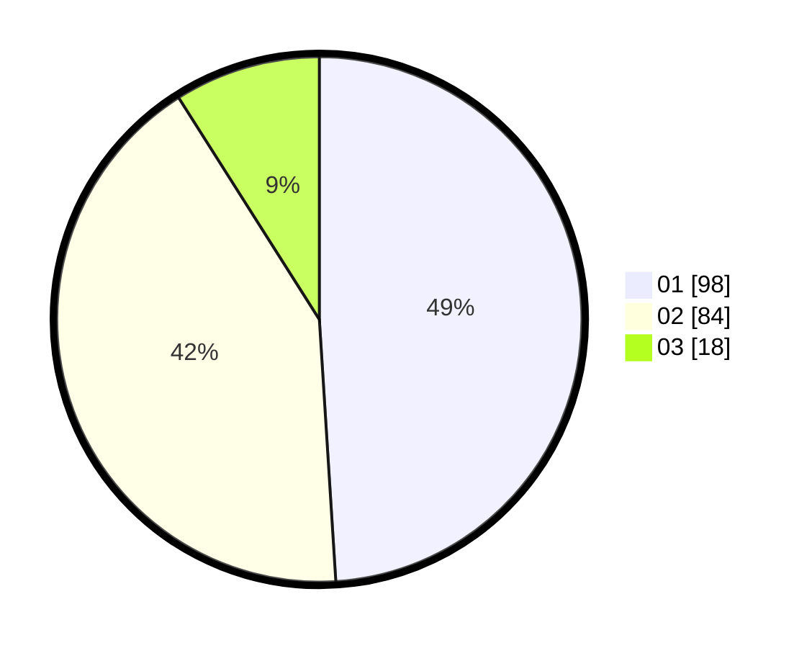

# Hasil

Hasil perolehan suara paslon dapat dilihat pada file paslon-01.txt, paslon-02.txt, dan paslon-03.txt.

Jika tidak ada, artinya data tersebut belum ada pada SIREKAP.

## Perolehan Suara

 * Paslon 01: **98**.
 * Paslon 02: **84**.
 * Paslon 03: **18**.

## Foto C Plano

https://sirekap-obj-formc.kpu.go.id/6922/pemilu/ppwp/31/75/06/10/03/3175061003326-20240214-185415--eecff01d-7d5b-4721-ad5d-ac2ecf4a1950.jpg

https://sirekap-obj-formc.kpu.go.id/6922/pemilu/ppwp/31/75/06/10/03/3175061003326-20240214-184716--2c55d8f5-cc39-4f16-98f7-7ca0df500c68.jpg

https://sirekap-obj-formc.kpu.go.id/6922/pemilu/ppwp/31/75/06/10/03/3175061003326-20240214-184854--3c1552cb-8d2f-4cf1-96b5-3b549b313258.jpg

## DATA PEMILIH TETAP

Jumlah pemilih dalam DPT: **249**.
 * L: **124**.
 * P: **125**.

## DATA PENGGUNA HAK PILIH

Jumlah pengguna hak pilih dalam DPT: **202**.
 * L: **96**.
 * P: **106**.

Jumlah pengguna hak pilih dalam DPTb: **0**.
 * L: **0**.
 * P: **0**.

Jumlah pengguna hak pilih dalam DPK: **2**.
 * L: **1**.
 * P: **1**.

Jumlah pengguna hak pilih: **204**.
 * L: **97**.
 * P: **107**.

## JUMLAH SUARA SAH DAN TIDAK SAH

JUMLAH SELURUH SUARA SAH: **200**.

JUMLAH SUARA TIDAK SAH: **4**.

JUMLAH SELURUH SUARA SAH DAN SUARA TIDAK SAH: **204**.
