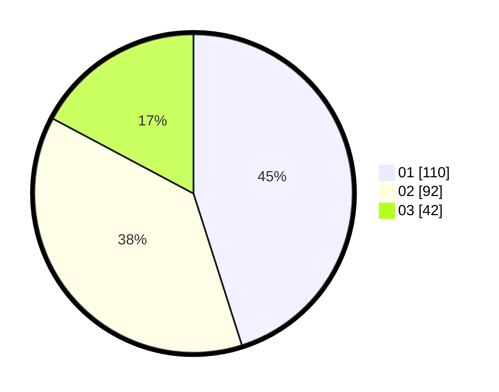

# Hasil

Hasil perolehan suara paslon dapat dilihat pada file paslon-01.txt, paslon-02.txt, dan paslon-03.txt.

Jika tidak ada, artinya data tersebut belum ada pada SIREKAP.

## Perolehan Suara

 * Paslon 01: **110**.
 * Paslon 02: **92**.
 * Paslon 03: **42**.

## Foto C Plano

https://sirekap-obj-formc.kpu.go.id/0f8b/pemilu/ppwp/31/75/06/10/04/3175061004002-20240215-043422--be090f07-9d9f-4392-86c6-e330a9932772.jpg

https://sirekap-obj-formc.kpu.go.id/0f8b/pemilu/ppwp/31/75/06/10/04/3175061004002-20240215-043447--cb59a7b1-2e03-474d-b5f5-a1f916f91554.jpg

https://sirekap-obj-formc.kpu.go.id/0f8b/pemilu/ppwp/31/75/06/10/04/3175061004002-20240215-043506--a97d173a-50f7-494d-a59f-42371623696b.jpg
