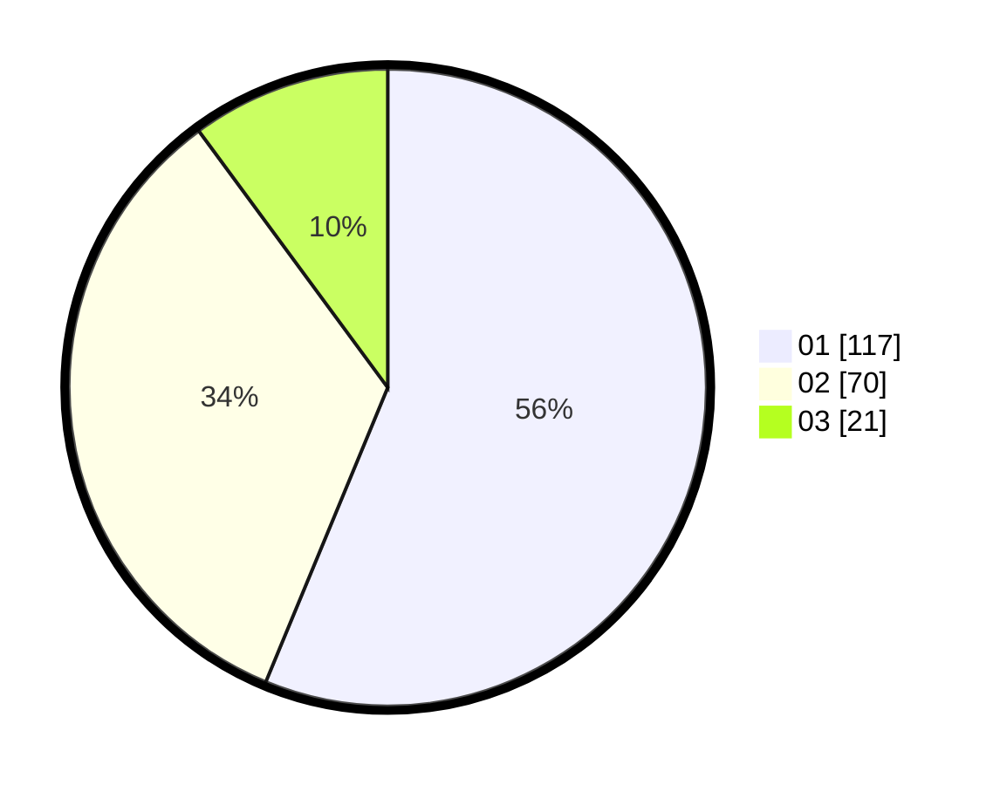

# Hasil

Hasil perolehan suara paslon dapat dilihat pada file paslon-01.txt, paslon-02.txt, dan paslon-03.txt.

Jika tidak ada, artinya data tersebut belum ada pada SIREKAP.

## Perolehan Suara

 * Paslon 01: **117**.
 * Paslon 02: **70**.
 * Paslon 03: **21**.

## Foto C Plano

https://sirekap-obj-formc.kpu.go.id/a5cd/pemilu/ppwp/31/75/06/10/04/3175061004003-20240214-212757--4487429a-5ec9-463b-8679-ed31dfb920be.jpg

https://sirekap-obj-formc.kpu.go.id/a5cd/pemilu/ppwp/31/75/06/10/04/3175061004003-20240214-212809--d131e9ad-ddb3-48f9-9860-b3b0c682ae74.jpg

https://sirekap-obj-formc.kpu.go.id/a5cd/pemilu/ppwp/31/75/06/10/04/3175061004003-20240214-212812--c5b8a2fc-9b21-4563-b355-119b896b847f.jpg
