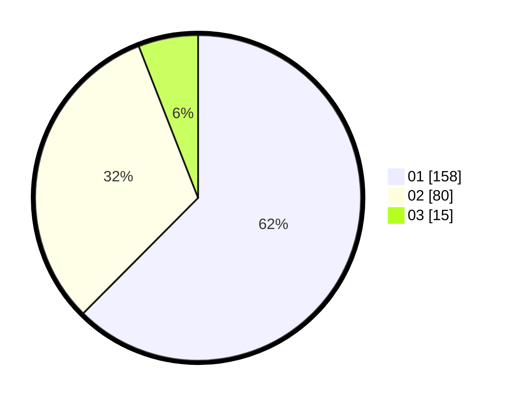

# Hasil

Hasil perolehan suara paslon dapat dilihat pada file paslon-01.txt, paslon-02.txt, dan paslon-03.txt.

Jika tidak ada, artinya data tersebut belum ada pada SIREKAP.

## Perolehan Suara

 * Paslon 01: **158**.
 * Paslon 02: **80**.
 * Paslon 03: **15**.

## Foto C Plano

https://sirekap-obj-formc.kpu.go.id/6725/pemilu/ppwp/31/75/06/10/04/3175061004007-20240214-233328--36a4c87b-d1ac-4280-879d-02339d1a8579.jpg

https://sirekap-obj-formc.kpu.go.id/6725/pemilu/ppwp/31/75/06/10/04/3175061004007-20240214-233720--3d38781d-a6c5-4c19-a698-2bbb83c95844.jpg

https://sirekap-obj-formc.kpu.go.id/6725/pemilu/ppwp/31/75/06/10/04/3175061004007-20240214-233857--d231ab02-e4ac-4898-8cc6-5fe1bca2fc3b.jpg

## DATA PEMILIH TETAP

Jumlah pemilih dalam DPT: **283**.
 * L: **136**.
 * P: **147**.

## DATA PENGGUNA HAK PILIH

Jumlah pengguna hak pilih dalam DPT: **252**.
 * L: **118**.
 * P: **134**.

Jumlah pengguna hak pilih dalam DPTb: **0**.
 * L: **0**.
 * P: **0**.

Jumlah pengguna hak pilih dalam DPK: **1**.
 * L: **1**.
 * P: **0**.

Jumlah pengguna hak pilih: **253**.
 * L: **119**.
 * P: **134**.

## JUMLAH SUARA SAH DAN TIDAK SAH

JUMLAH SELURUH SUARA SAH: **253**.

JUMLAH SUARA TIDAK SAH: **0**.

JUMLAH SELURUH SUARA SAH DAN SUARA TIDAK SAH: **253**.
