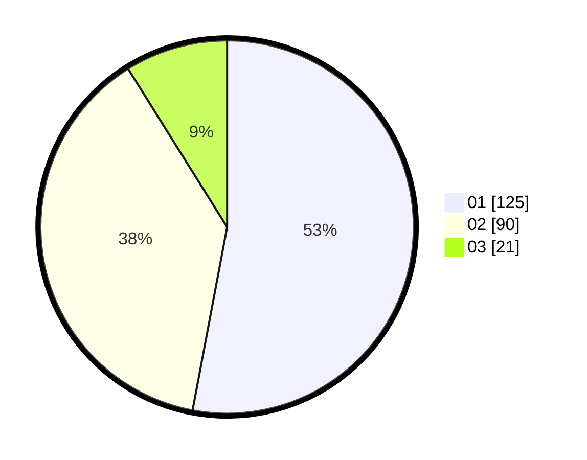

# Hasil

Hasil perolehan suara paslon dapat dilihat pada file paslon-01.txt, paslon-02.txt, dan paslon-03.txt.

Jika tidak ada, artinya data tersebut belum ada pada SIREKAP.

## Perolehan Suara

 * Paslon 01: **125**.
 * Paslon 02: **90**.
 * Paslon 03: **21**.

## Foto C Plano

https://sirekap-obj-formc.kpu.go.id/162e/pemilu/ppwp/31/75/06/10/04/3175061004021-20240214-185909--a3e23d12-2754-4658-99ce-42790ced9a21.jpg

https://sirekap-obj-formc.kpu.go.id/162e/pemilu/ppwp/31/75/06/10/04/3175061004021-20240214-185849--8b0bd8e0-89e1-4c9b-bde6-3639f43e846c.jpg

https://sirekap-obj-formc.kpu.go.id/162e/pemilu/ppwp/31/75/06/10/04/3175061004021-20240214-185927--40a4d43b-3c7e-469d-a594-ea505f8a60d3.jpg

## DATA PEMILIH TETAP

Jumlah pemilih dalam DPT: **289**.
 * L: **154**.
 * P: **135**.

## DATA PENGGUNA HAK PILIH

Jumlah pengguna hak pilih dalam DPT: **241**.
 * L: **119**.
 * P: **122**.

Jumlah pengguna hak pilih dalam DPTb: **0**.
 * L: **0**.
 * P: **0**.

Jumlah pengguna hak pilih dalam DPK: **0**.
 * L: **0**.
 * P: **0**.

Jumlah pengguna hak pilih: **241**.
 * L: **119**.
 * P: **122**.

## JUMLAH SUARA SAH DAN TIDAK SAH

JUMLAH SELURUH SUARA SAH: **236**.

JUMLAH SUARA TIDAK SAH: **5**.

JUMLAH SELURUH SUARA SAH DAN SUARA TIDAK SAH: **241**.
