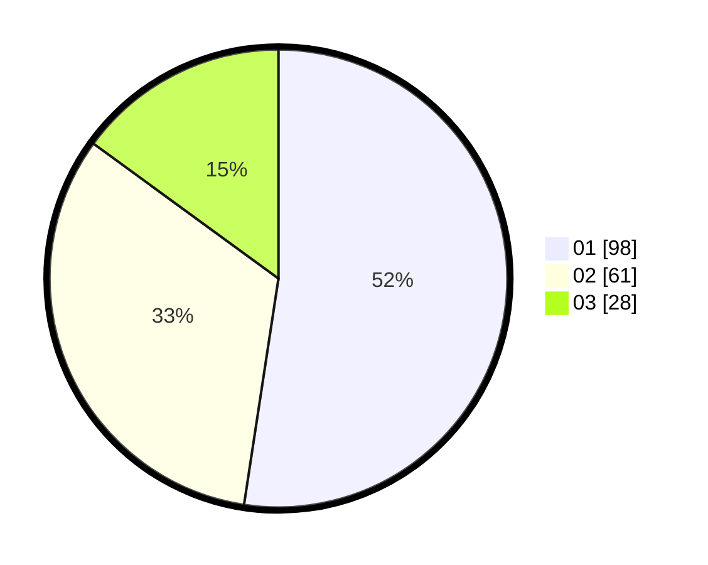

# Hasil

Hasil perolehan suara paslon dapat dilihat pada file paslon-01.txt, paslon-02.txt, dan paslon-03.txt.

Jika tidak ada, artinya data tersebut belum ada pada SIREKAP.

## Perolehan Suara

 * Paslon 01: **98**.
 * Paslon 02: **61**.
 * Paslon 03: **28**.

## Foto C Plano

https://sirekap-obj-formc.kpu.go.id/03d3/pemilu/ppwp/31/75/06/10/04/3175061004028-20240215-133852--54be280a-70a9-4148-b3ee-9c56d7ae45e6.jpg

https://sirekap-obj-formc.kpu.go.id/03d3/pemilu/ppwp/31/75/06/10/04/3175061004028-20240215-133918--67954ad3-e80d-47fe-bc98-bf7d27275e5a.jpg

https://sirekap-obj-formc.kpu.go.id/03d3/pemilu/ppwp/31/75/06/10/04/3175061004028-20240215-133904--fd92c8d9-30dd-45de-bf27-692074931fcb.jpg

## DATA PEMILIH TETAP

Jumlah pemilih dalam DPT: **257**.
 * L: **126**.
 * P: **131**.

## DATA PENGGUNA HAK PILIH

Jumlah pengguna hak pilih dalam DPT: **188**.
 * L: **88**.
 * P: **100**.

Jumlah pengguna hak pilih dalam DPTb: **0**.
 * L: **0**.
 * P: **0**.

Jumlah pengguna hak pilih dalam DPK: **0**.
 * L: **0**.
 * P: **0**.

Jumlah pengguna hak pilih: **188**.
 * L: **88**.
 * P: **100**.

## JUMLAH SUARA SAH DAN TIDAK SAH

JUMLAH SELURUH SUARA SAH: **187**.

JUMLAH SUARA TIDAK SAH: **1**.

JUMLAH SELURUH SUARA SAH DAN SUARA TIDAK SAH: **188**.
