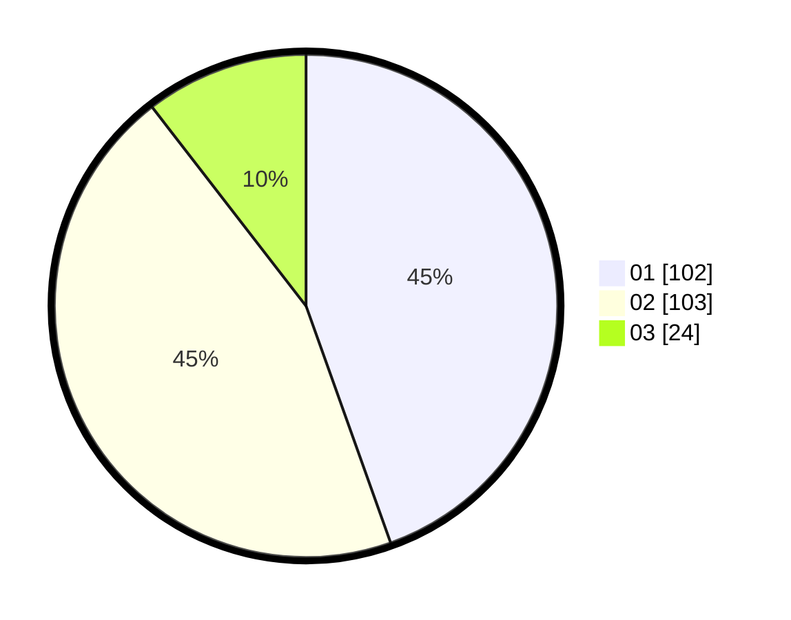

# Hasil

Hasil perolehan suara paslon dapat dilihat pada file paslon-01.txt, paslon-02.txt, dan paslon-03.txt.

Jika tidak ada, artinya data tersebut belum ada pada SIREKAP.

## Perolehan Suara

 * Paslon 01: **102**.
 * Paslon 02: **103**.
 * Paslon 03: **24**.

## Foto C Plano

https://sirekap-obj-formc.kpu.go.id/b6ba/pemilu/ppwp/31/75/06/10/04/3175061004032-20240214-222158--5e9b88fb-842f-4586-9d4d-b4401e5e0f21.jpg

https://sirekap-obj-formc.kpu.go.id/b6ba/pemilu/ppwp/31/75/06/10/04/3175061004032-20240214-222111--2b674389-1e79-4eab-9e72-19c12afefbb8.jpg

https://sirekap-obj-formc.kpu.go.id/b6ba/pemilu/ppwp/31/75/06/10/04/3175061004032-20240214-222018--1aba7f62-f01b-4948-a76e-5de6bbda09c8.jpg

## DATA PEMILIH TETAP

Jumlah pemilih dalam DPT: **285**.
 * L: **135**.
 * P: **150**.

## DATA PENGGUNA HAK PILIH

Jumlah pengguna hak pilih dalam DPT: **229**.
 * L: **109**.
 * P: **120**.

Jumlah pengguna hak pilih dalam DPTb: **0**.
 * L: **0**.
 * P: **0**.

Jumlah pengguna hak pilih dalam DPK: **1**.
 * L: **0**.
 * P: **1**.

Jumlah pengguna hak pilih: **230**.
 * L: **109**.
 * P: **121**.

## JUMLAH SUARA SAH DAN TIDAK SAH

JUMLAH SELURUH SUARA SAH: **229**.

JUMLAH SUARA TIDAK SAH: **1**.

JUMLAH SELURUH SUARA SAH DAN SUARA TIDAK SAH: **230**.
