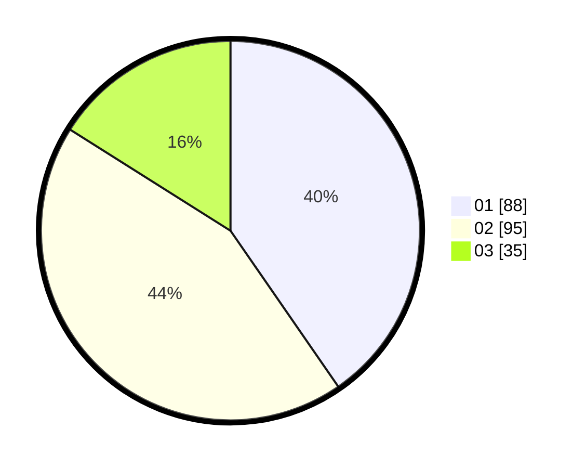

# Hasil

Hasil perolehan suara paslon dapat dilihat pada file paslon-01.txt, paslon-02.txt, dan paslon-03.txt.

Jika tidak ada, artinya data tersebut belum ada pada SIREKAP.

## Perolehan Suara

 * Paslon 01: **88**.
 * Paslon 02: **95**.
 * Paslon 03: **35**.

## Foto C Plano

https://sirekap-obj-formc.kpu.go.id/01fc/pemilu/ppwp/31/75/06/10/04/3175061004036-20240214-192941--5790e4c1-d3f9-44e2-9f5f-7c0c5f08fa5a.jpg

https://sirekap-obj-formc.kpu.go.id/01fc/pemilu/ppwp/31/75/06/10/04/3175061004036-20240214-193145--2b977586-b864-420a-a000-16c087dd6add.jpg

https://sirekap-obj-formc.kpu.go.id/01fc/pemilu/ppwp/31/75/06/10/04/3175061004036-20240214-204525--001dcb94-d138-4db9-bd02-4fe92e6d97d9.jpg

## DATA PEMILIH TETAP

Jumlah pemilih dalam DPT: **290**.
 * L: **150**.
 * P: **140**.

## DATA PENGGUNA HAK PILIH

Jumlah pengguna hak pilih dalam DPT: **221**.
 * L: **104**.
 * P: **117**.

Jumlah pengguna hak pilih dalam DPTb: **0**.
 * L: **0**.
 * P: **0**.

Jumlah pengguna hak pilih dalam DPK: **1**.
 * L: **1**.
 * P: **0**.

Jumlah pengguna hak pilih: **222**.
 * L: **105**.
 * P: **117**.

## JUMLAH SUARA SAH DAN TIDAK SAH

JUMLAH SELURUH SUARA SAH: **218**.

JUMLAH SUARA TIDAK SAH: **4**.

JUMLAH SELURUH SUARA SAH DAN SUARA TIDAK SAH: **222**.
