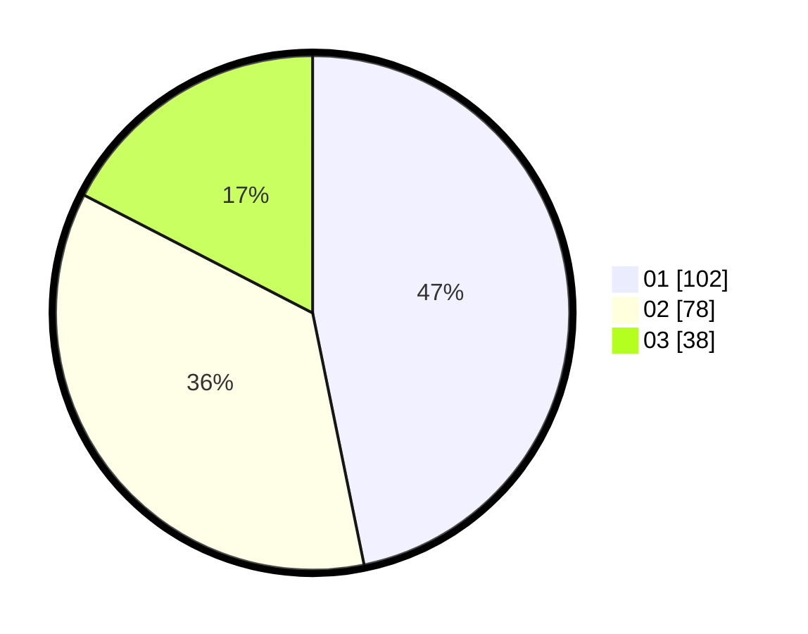

# Hasil

Hasil perolehan suara paslon dapat dilihat pada file paslon-01.txt, paslon-02.txt, dan paslon-03.txt.

Jika tidak ada, artinya data tersebut belum ada pada SIREKAP.

## Perolehan Suara

 * Paslon 01: **102**.
 * Paslon 02: **78**.
 * Paslon 03: **38**.

## Foto C Plano

https://sirekap-obj-formc.kpu.go.id/5316/pemilu/ppwp/31/75/06/10/04/3175061004039-20240215-213748--64ed73a7-bd51-4cbe-a870-7be545956f7e.jpg

https://sirekap-obj-formc.kpu.go.id/5316/pemilu/ppwp/31/75/06/10/04/3175061004039-20240215-213750--bba70767-85c4-4aaf-affa-c61161a7ffdf.jpg

https://sirekap-obj-formc.kpu.go.id/5316/pemilu/ppwp/31/75/06/10/04/3175061004039-20240215-213749--b40055f0-8341-46bd-9fb5-429a6cabe8d7.jpg

## DATA PEMILIH TETAP

Jumlah pemilih dalam DPT: **252**.
 * L: **127**.
 * P: **125**.

## DATA PENGGUNA HAK PILIH

Jumlah pengguna hak pilih dalam DPT: **213**.
 * L: **103**.
 * P: **110**.

Jumlah pengguna hak pilih dalam DPTb: **7**.
 * L: **5**.
 * P: **2**.

Jumlah pengguna hak pilih dalam DPK: **2**.
 * L: **0**.
 * P: **2**.

Jumlah pengguna hak pilih: **222**.
 * L: **108**.
 * P: **114**.

## JUMLAH SUARA SAH DAN TIDAK SAH

JUMLAH SELURUH SUARA SAH: **218**.

JUMLAH SUARA TIDAK SAH: **4**.

JUMLAH SELURUH SUARA SAH DAN SUARA TIDAK SAH: **222**.
