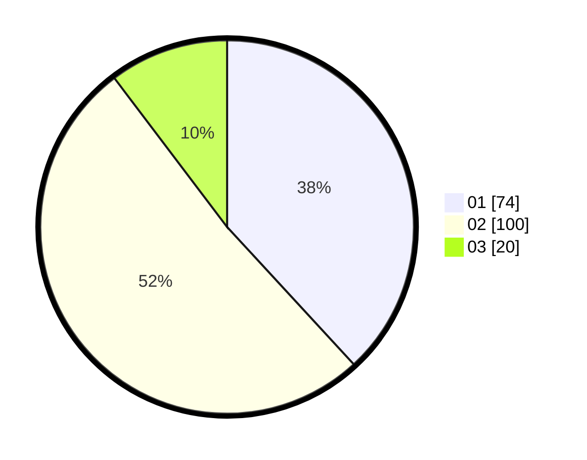

# Hasil

Hasil perolehan suara paslon dapat dilihat pada file paslon-01.txt, paslon-02.txt, dan paslon-03.txt.

Jika tidak ada, artinya data tersebut belum ada pada SIREKAP.

## Perolehan Suara

 * Paslon 01: **74**.
 * Paslon 02: **100**.
 * Paslon 03: **20**.

## Foto C Plano

https://sirekap-obj-formc.kpu.go.id/a5f1/pemilu/ppwp/31/75/06/10/04/3175061004041-20240214-234606--35e61595-18e0-47d4-90c5-8823db8363c8.jpg

https://sirekap-obj-formc.kpu.go.id/a5f1/pemilu/ppwp/31/75/06/10/04/3175061004041-20240214-192927--b20e36ab-d2d6-455f-8674-874f3cd3d43a.jpg

https://sirekap-obj-formc.kpu.go.id/a5f1/pemilu/ppwp/31/75/06/10/04/3175061004041-20240214-192946--f02af52d-e81f-4fed-bb51-51e00010844d.jpg
