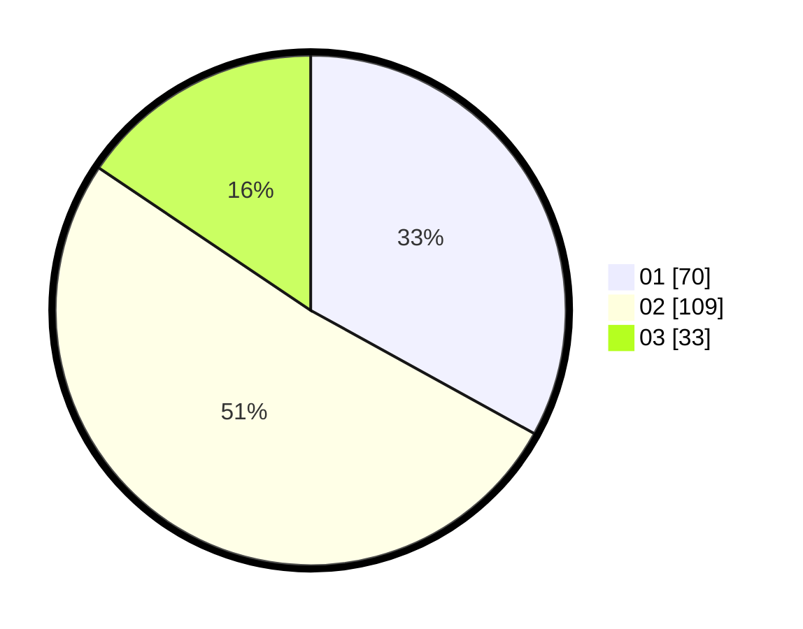

# Hasil

Hasil perolehan suara paslon dapat dilihat pada file paslon-01.txt, paslon-02.txt, dan paslon-03.txt.

Jika tidak ada, artinya data tersebut belum ada pada SIREKAP.

## Perolehan Suara

 * Paslon 01: **70**.
 * Paslon 02: **109**.
 * Paslon 03: **33**.

## Foto C Plano

https://sirekap-obj-formc.kpu.go.id/26d1/pemilu/ppwp/31/75/06/10/04/3175061004043-20240214-234623--752c9c52-2039-41d7-ac98-d10824f36e43.jpg

https://sirekap-obj-formc.kpu.go.id/26d1/pemilu/ppwp/31/75/06/10/04/3175061004043-20240214-234507--4e2921f4-071b-4387-bb9b-970af525bfd2.jpg

https://sirekap-obj-formc.kpu.go.id/26d1/pemilu/ppwp/31/75/06/10/04/3175061004043-20240214-234358--6c527877-b32e-44dc-987c-6ed9b587dc25.jpg

## DATA PEMILIH TETAP

Jumlah pemilih dalam DPT: **286**.
 * L: **141**.
 * P: **145**.

## DATA PENGGUNA HAK PILIH

Jumlah pengguna hak pilih dalam DPT: **212**.
 * L: **104**.
 * P: **108**.

Jumlah pengguna hak pilih dalam DPTb: **0**.
 * L: **0**.
 * P: **0**.

Jumlah pengguna hak pilih dalam DPK: **2**.
 * L: **1**.
 * P: **1**.

Jumlah pengguna hak pilih: **214**.
 * L: **105**.
 * P: **109**.

## JUMLAH SUARA SAH DAN TIDAK SAH

JUMLAH SELURUH SUARA SAH: **212**.

JUMLAH SUARA TIDAK SAH: **2**.

JUMLAH SELURUH SUARA SAH DAN SUARA TIDAK SAH: **214**.
