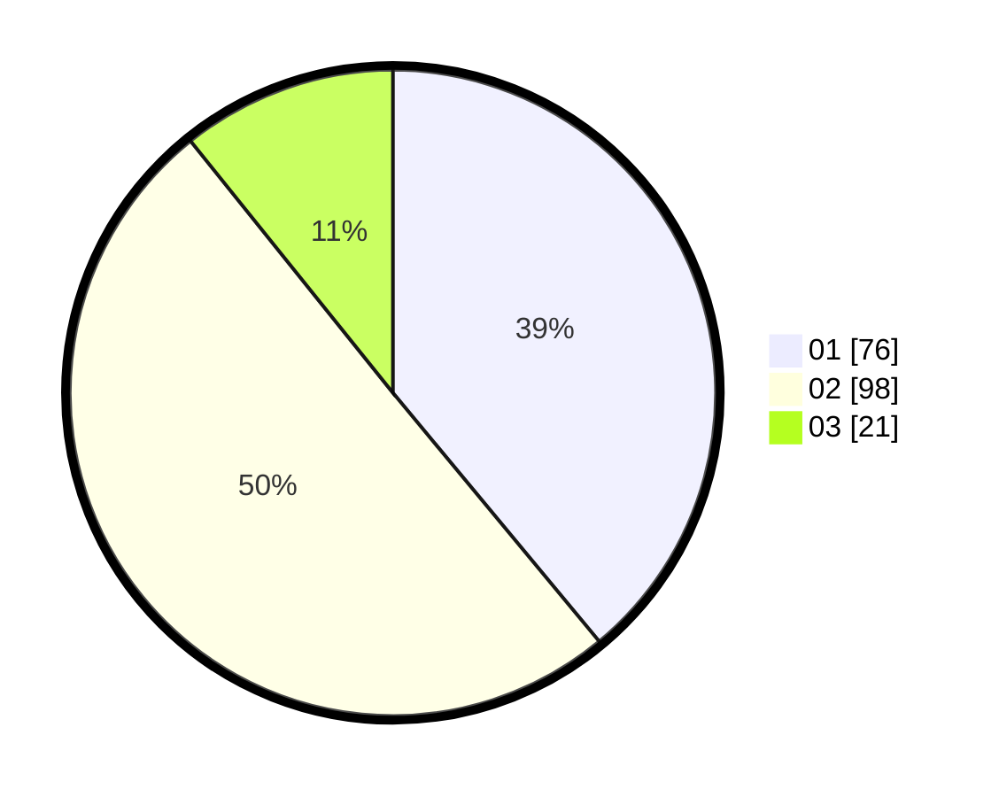

# Hasil

Hasil perolehan suara paslon dapat dilihat pada file paslon-01.txt, paslon-02.txt, dan paslon-03.txt.

Jika tidak ada, artinya data tersebut belum ada pada SIREKAP.

## Perolehan Suara

 * Paslon 01: **76**.
 * Paslon 02: **98**.
 * Paslon 03: **21**.

## Foto C Plano

https://sirekap-obj-formc.kpu.go.id/4fd0/pemilu/ppwp/31/75/06/10/04/3175061004055-20240214-155413--34fc3410-5e1a-4e84-866c-6704e7f9acd8.jpg

https://sirekap-obj-formc.kpu.go.id/4fd0/pemilu/ppwp/31/75/06/10/04/3175061004055-20240214-155519--dadf679a-c3d6-4ba0-90c5-391da6203ad7.jpg

https://sirekap-obj-formc.kpu.go.id/4fd0/pemilu/ppwp/31/75/06/10/04/3175061004055-20240214-155726--bf7512d0-7ed6-4b1e-9398-357f008778d3.jpg

## DATA PEMILIH TETAP

Jumlah pemilih dalam DPT: **264**.
 * L: **133**.
 * P: **131**.

## DATA PENGGUNA HAK PILIH

Jumlah pengguna hak pilih dalam DPT: **196**.
 * L: **94**.
 * P: **102**.

Jumlah pengguna hak pilih dalam DPTb: **0**.
 * L: **0**.
 * P: **0**.

Jumlah pengguna hak pilih dalam DPK: **0**.
 * L: **0**.
 * P: **0**.

Jumlah pengguna hak pilih: **196**.
 * L: **94**.
 * P: **102**.

## JUMLAH SUARA SAH DAN TIDAK SAH

JUMLAH SELURUH SUARA SAH: **195**.

JUMLAH SUARA TIDAK SAH: **1**.

JUMLAH SELURUH SUARA SAH DAN SUARA TIDAK SAH: **196**.
