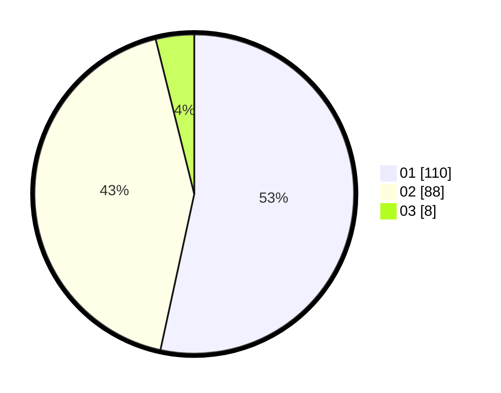

# Hasil

Hasil perolehan suara paslon dapat dilihat pada file paslon-01.txt, paslon-02.txt, dan paslon-03.txt.

Jika tidak ada, artinya data tersebut belum ada pada SIREKAP.

## Perolehan Suara

 * Paslon 01: **110**.
 * Paslon 02: **88**.
 * Paslon 03: **8**.

## Foto C Plano

https://sirekap-obj-formc.kpu.go.id/dc90/pemilu/ppwp/31/75/06/10/04/3175061004070-20240216-083714--49d3ac95-8398-42ef-a314-1c4a974e461c.jpg

https://sirekap-obj-formc.kpu.go.id/dc90/pemilu/ppwp/31/75/06/10/04/3175061004070-20240216-083716--c373f85d-8ee2-4365-9721-486c963cc771.jpg

https://sirekap-obj-formc.kpu.go.id/dc90/pemilu/ppwp/31/75/06/10/04/3175061004070-20240216-083715--6c6c32ee-63ef-4cc1-9d01-dedb3cd8b972.jpg

## DATA PEMILIH TETAP

Jumlah pemilih dalam DPT: **0**.
 * L: **0**.
 * P: **0**.

## DATA PENGGUNA HAK PILIH

Jumlah pengguna hak pilih dalam DPT: **0**.
 * L: **0**.
 * P: **0**.

Jumlah pengguna hak pilih dalam DPTb: **0**.
 * L: **0**.
 * P: **0**.

Jumlah pengguna hak pilih dalam DPK: **0**.
 * L: **0**.
 * P: **0**.

Jumlah pengguna hak pilih: **0**.
 * L: **0**.
 * P: **0**.

## JUMLAH SUARA SAH DAN TIDAK SAH

JUMLAH SELURUH SUARA SAH: **206**.

JUMLAH SUARA TIDAK SAH: **4**.

JUMLAH SELURUH SUARA SAH DAN SUARA TIDAK SAH: **210**.
