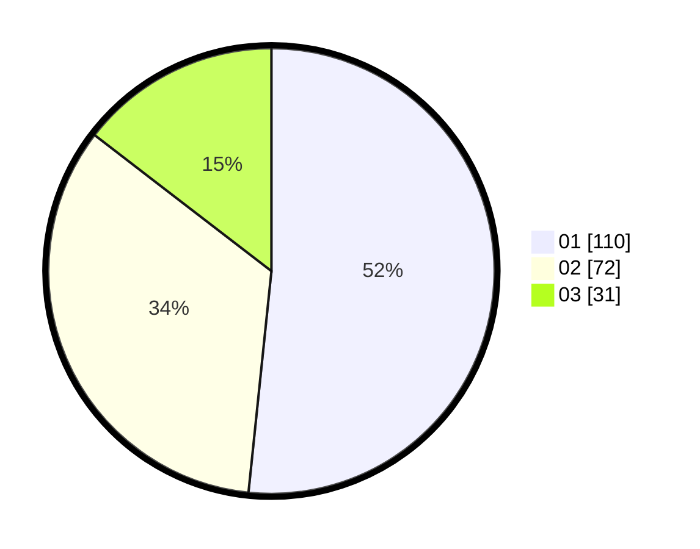

# Hasil

Hasil perolehan suara paslon dapat dilihat pada file paslon-01.txt, paslon-02.txt, dan paslon-03.txt.

Jika tidak ada, artinya data tersebut belum ada pada SIREKAP.

## Perolehan Suara

 * Paslon 01: **110**.
 * Paslon 02: **72**.
 * Paslon 03: **31**.

## Foto C Plano

https://sirekap-obj-formc.kpu.go.id/ca2b/pemilu/ppwp/31/75/06/10/04/3175061004077-20240216-003427--1a5f39fc-25c9-4f03-a869-fba4a0f404a8.jpg

https://sirekap-obj-formc.kpu.go.id/ca2b/pemilu/ppwp/31/75/06/10/04/3175061004077-20240216-003435--5cbca168-e5c6-4606-8abb-a432daa239a9.jpg

https://sirekap-obj-formc.kpu.go.id/ca2b/pemilu/ppwp/31/75/06/10/04/3175061004077-20240216-003431--48cb892f-ccac-44a5-9a28-393695bae2df.jpg

## DATA PEMILIH TETAP

Jumlah pemilih dalam DPT: **276**.
 * L: **122**.
 * P: **154**.

## DATA PENGGUNA HAK PILIH

Jumlah pengguna hak pilih dalam DPT: **213**.
 * L: **97**.
 * P: **116**.

Jumlah pengguna hak pilih dalam DPTb: **1**.
 * L: **1**.
 * P: **0**.

Jumlah pengguna hak pilih dalam DPK: **1**.
 * L: **0**.
 * P: **1**.

Jumlah pengguna hak pilih: **215**.
 * L: **98**.
 * P: **117**.

## JUMLAH SUARA SAH DAN TIDAK SAH

JUMLAH SELURUH SUARA SAH: **213**.

JUMLAH SUARA TIDAK SAH: **2**.

JUMLAH SELURUH SUARA SAH DAN SUARA TIDAK SAH: **215**.
