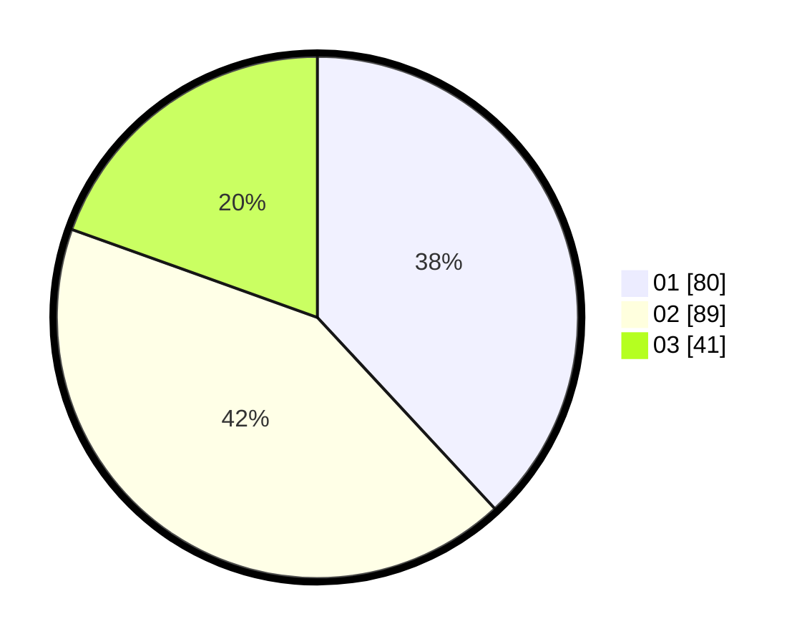

# Hasil

Hasil perolehan suara paslon dapat dilihat pada file paslon-01.txt, paslon-02.txt, dan paslon-03.txt.

Jika tidak ada, artinya data tersebut belum ada pada SIREKAP.

## Perolehan Suara

 * Paslon 01: **80**.
 * Paslon 02: **89**.
 * Paslon 03: **41**.

## Foto C Plano

https://sirekap-obj-formc.kpu.go.id/030a/pemilu/ppwp/31/75/06/10/04/3175061004081-20240214-191926--8167ccca-8763-484b-97e8-18d64d9d0cbe.jpg

https://sirekap-obj-formc.kpu.go.id/030a/pemilu/ppwp/31/75/06/10/04/3175061004081-20240214-192115--74c563e6-d178-4dd5-af52-5c320c5e2b0f.jpg

https://sirekap-obj-formc.kpu.go.id/030a/pemilu/ppwp/31/75/06/10/04/3175061004081-20240214-192022--844e1c02-c11a-45ee-a946-85447c594103.jpg

## DATA PEMILIH TETAP

Jumlah pemilih dalam DPT: **251**.
 * L: **120**.
 * P: **131**.

## DATA PENGGUNA HAK PILIH

Jumlah pengguna hak pilih dalam DPT: **204**.
 * L: **101**.
 * P: **103**.

Jumlah pengguna hak pilih dalam DPTb: **1**.
 * L: **1**.
 * P: **0**.

Jumlah pengguna hak pilih dalam DPK: **6**.
 * L: **3**.
 * P: **3**.

Jumlah pengguna hak pilih: **211**.
 * L: **105**.
 * P: **106**.

## JUMLAH SUARA SAH DAN TIDAK SAH

JUMLAH SELURUH SUARA SAH: **210**.

JUMLAH SUARA TIDAK SAH: **1**.

JUMLAH SELURUH SUARA SAH DAN SUARA TIDAK SAH: **211**.
