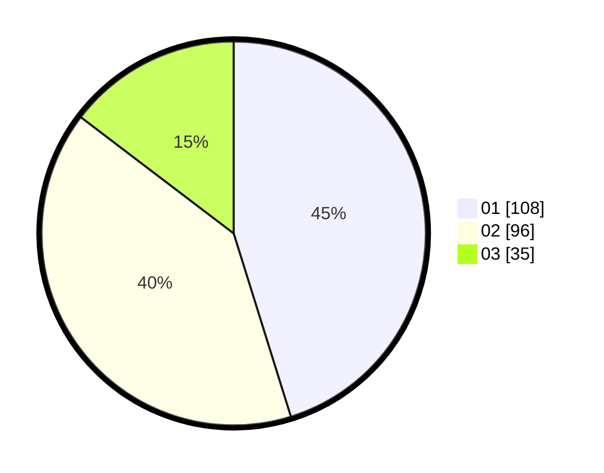

# Hasil

Hasil perolehan suara paslon dapat dilihat pada file paslon-01.txt, paslon-02.txt, dan paslon-03.txt.

Jika tidak ada, artinya data tersebut belum ada pada SIREKAP.

## Perolehan Suara

 * Paslon 01: **108**.
 * Paslon 02: **96**.
 * Paslon 03: **35**.

## Foto C Plano

https://sirekap-obj-formc.kpu.go.id/e4f9/pemilu/ppwp/31/75/06/10/04/3175061004091-20240214-194852--e4163dcc-f25a-4378-bc8e-492267999ef1.jpg

https://sirekap-obj-formc.kpu.go.id/e4f9/pemilu/ppwp/31/75/06/10/04/3175061004091-20240214-195020--41d67ab2-6515-466d-bd2f-7db1a6aa204d.jpg

https://sirekap-obj-formc.kpu.go.id/e4f9/pemilu/ppwp/31/75/06/10/04/3175061004091-20240214-195142--01e27f16-68fa-4a25-b23f-b5b8434b426b.jpg

## DATA PEMILIH TETAP

Jumlah pemilih dalam DPT: **288**.
 * L: **133**.
 * P: **153**.

## DATA PENGGUNA HAK PILIH

Jumlah pengguna hak pilih dalam DPT: **237**.
 * L: **108**.
 * P: **129**.

Jumlah pengguna hak pilih dalam DPTb: **2**.
 * L: **2**.
 * P: **0**.

Jumlah pengguna hak pilih dalam DPK: **6**.
 * L: **3**.
 * P: **3**.

Jumlah pengguna hak pilih: **245**.
 * L: **113**.
 * P: **132**.

## JUMLAH SUARA SAH DAN TIDAK SAH

JUMLAH SELURUH SUARA SAH: **239**.

JUMLAH SUARA TIDAK SAH: **6**.

JUMLAH SELURUH SUARA SAH DAN SUARA TIDAK SAH: **245**.
