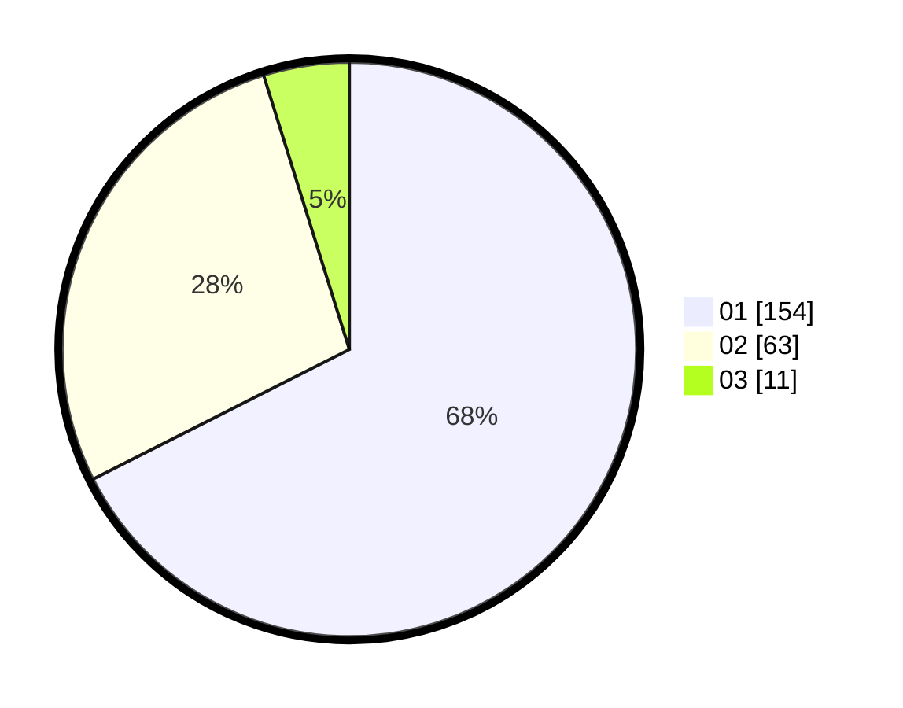

# Hasil

Hasil perolehan suara paslon dapat dilihat pada file paslon-01.txt, paslon-02.txt, dan paslon-03.txt.

Jika tidak ada, artinya data tersebut belum ada pada SIREKAP.

## Perolehan Suara

 * Paslon 01: **154**.
 * Paslon 02: **63**.
 * Paslon 03: **11**.

## Foto C Plano

https://sirekap-obj-formc.kpu.go.id/99dc/pemilu/ppwp/31/75/06/10/04/3175061004116-20240214-155248--fe55cb6e-b84c-4e36-95e3-4a81672fef32.jpg

https://sirekap-obj-formc.kpu.go.id/99dc/pemilu/ppwp/31/75/06/10/04/3175061004116-20240214-155407--03348ec4-6c96-40d6-8c7f-f99a099a4968.jpg

https://sirekap-obj-formc.kpu.go.id/99dc/pemilu/ppwp/31/75/06/10/04/3175061004116-20240214-155133--67b55500-d55c-4c75-9202-8d22fd59e15a.jpg

## DATA PEMILIH TETAP

Jumlah pemilih dalam DPT: **263**.
 * L: **135**.
 * P: **128**.

## DATA PENGGUNA HAK PILIH

Jumlah pengguna hak pilih dalam DPT: **223**.
 * L: **109**.
 * P: **114**.

Jumlah pengguna hak pilih dalam DPTb: **0**.
 * L: **0**.
 * P: **0**.

Jumlah pengguna hak pilih dalam DPK: **8**.
 * L: **5**.
 * P: **3**.

Jumlah pengguna hak pilih: **231**.
 * L: **114**.
 * P: **117**.

## JUMLAH SUARA SAH DAN TIDAK SAH

JUMLAH SELURUH SUARA SAH: **228**.

JUMLAH SUARA TIDAK SAH: **3**.

JUMLAH SELURUH SUARA SAH DAN SUARA TIDAK SAH: **231**.
