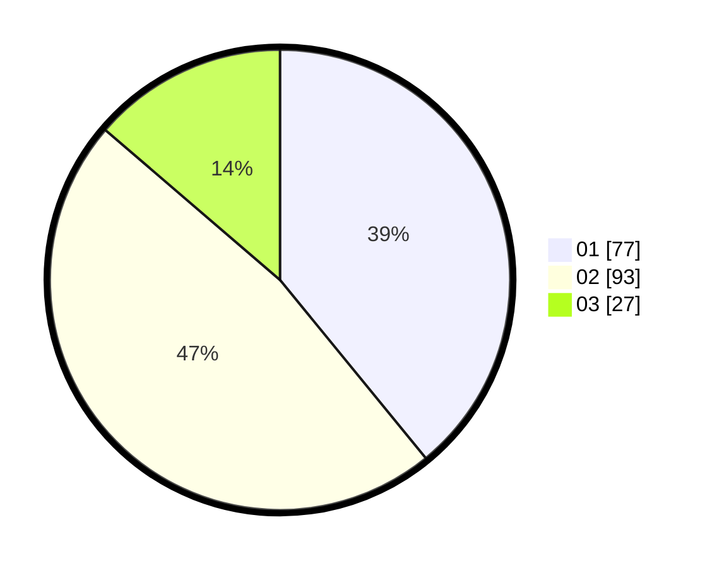

# Hasil

Hasil perolehan suara paslon dapat dilihat pada file paslon-01.txt, paslon-02.txt, dan paslon-03.txt.

Jika tidak ada, artinya data tersebut belum ada pada SIREKAP.

## Perolehan Suara

 * Paslon 01: **77**.
 * Paslon 02: **93**.
 * Paslon 03: **27**.

## Foto C Plano

https://sirekap-obj-formc.kpu.go.id/740b/pemilu/ppwp/31/75/06/10/04/3175061004119-20240214-201018--9be52436-aa47-4afb-aa43-25d90029efa8.jpg

https://sirekap-obj-formc.kpu.go.id/740b/pemilu/ppwp/31/75/06/10/04/3175061004119-20240214-232434--388c2a9f-eb42-4122-9b68-5db4877957dc.jpg

https://sirekap-obj-formc.kpu.go.id/740b/pemilu/ppwp/31/75/06/10/04/3175061004119-20240214-232507--a3d02f3f-fd3c-44a3-bdd5-1785e6335c4d.jpg

## DATA PEMILIH TETAP

Jumlah pemilih dalam DPT: **263**.
 * L: **137**.
 * P: **126**.

## DATA PENGGUNA HAK PILIH

Jumlah pengguna hak pilih dalam DPT: **193**.
 * L: **97**.
 * P: **96**.

Jumlah pengguna hak pilih dalam DPTb: **2**.
 * L: **1**.
 * P: **1**.

Jumlah pengguna hak pilih dalam DPK: **4**.
 * L: **2**.
 * P: **2**.

Jumlah pengguna hak pilih: **199**.
 * L: **100**.
 * P: **99**.

## JUMLAH SUARA SAH DAN TIDAK SAH

JUMLAH SELURUH SUARA SAH: **197**.

JUMLAH SUARA TIDAK SAH: **2**.

JUMLAH SELURUH SUARA SAH DAN SUARA TIDAK SAH: **199**.
