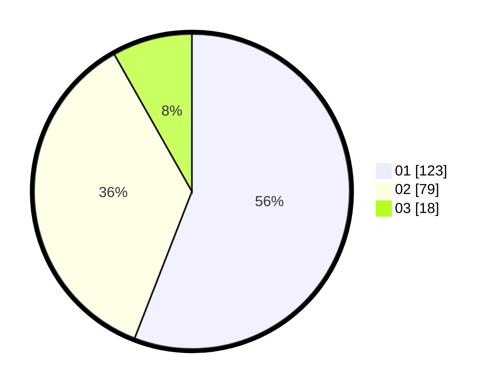

# Hasil

Hasil perolehan suara paslon dapat dilihat pada file paslon-01.txt, paslon-02.txt, dan paslon-03.txt.

Jika tidak ada, artinya data tersebut belum ada pada SIREKAP.

## Perolehan Suara

 * Paslon 01: **123**.
 * Paslon 02: **79**.
 * Paslon 03: **18**.

## Foto C Plano

https://sirekap-obj-formc.kpu.go.id/77fc/pemilu/ppwp/31/75/06/10/04/3175061004120-20240214-155716--269c4618-434f-4482-86ef-dcd8ade5c31b.jpg

https://sirekap-obj-formc.kpu.go.id/77fc/pemilu/ppwp/31/75/06/10/04/3175061004120-20240214-155746--a958b1b8-5743-4e10-9737-2264c66ae187.jpg

https://sirekap-obj-formc.kpu.go.id/77fc/pemilu/ppwp/31/75/06/10/04/3175061004120-20240214-155812--b7507bc2-749c-4bef-b475-ea002f3ac607.jpg

## DATA PEMILIH TETAP

Jumlah pemilih dalam DPT: **261**.
 * L: **130**.
 * P: **131**.

## DATA PENGGUNA HAK PILIH

Jumlah pengguna hak pilih dalam DPT: **220**.
 * L: **108**.
 * P: **112**.

Jumlah pengguna hak pilih dalam DPTb: **0**.
 * L: **0**.
 * P: **0**.

Jumlah pengguna hak pilih dalam DPK: **2**.
 * L: **0**.
 * P: **2**.

Jumlah pengguna hak pilih: **222**.
 * L: **108**.
 * P: **114**.

## JUMLAH SUARA SAH DAN TIDAK SAH

JUMLAH SELURUH SUARA SAH: **220**.

JUMLAH SUARA TIDAK SAH: **2**.

JUMLAH SELURUH SUARA SAH DAN SUARA TIDAK SAH: **222**.
