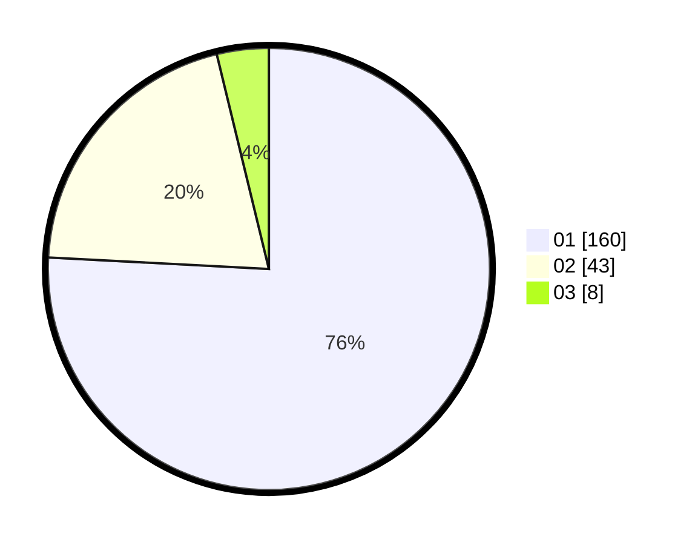

# Hasil

Hasil perolehan suara paslon dapat dilihat pada file paslon-01.txt, paslon-02.txt, dan paslon-03.txt.

Jika tidak ada, artinya data tersebut belum ada pada SIREKAP.

## Perolehan Suara

 * Paslon 01: **160**.
 * Paslon 02: **43**.
 * Paslon 03: **8**.

## Foto C Plano

https://sirekap-obj-formc.kpu.go.id/dfb5/pemilu/ppwp/31/75/06/10/04/3175061004122-20240214-204503--a851174a-5aa1-4f67-b3f6-40932bb38e6c.jpg

https://sirekap-obj-formc.kpu.go.id/dfb5/pemilu/ppwp/31/75/06/10/04/3175061004122-20240214-204623--3b751fad-afce-4ea2-a573-f40c18eceeb4.jpg

https://sirekap-obj-formc.kpu.go.id/dfb5/pemilu/ppwp/31/75/06/10/04/3175061004122-20240214-204210--36f8fb2c-2518-4e19-8478-5106b0d1c90d.jpg

## DATA PEMILIH TETAP

Jumlah pemilih dalam DPT: **260**.
 * L: **135**.
 * P: **125**.

## DATA PENGGUNA HAK PILIH

Jumlah pengguna hak pilih dalam DPT: **260**.
 * L: **135**.
 * P: **125**.

Jumlah pengguna hak pilih dalam DPTb: **0**.
 * L: **0**.
 * P: **0**.

Jumlah pengguna hak pilih dalam DPK: **2**.
 * L: **2**.
 * P: **0**.

Jumlah pengguna hak pilih: **262**.
 * L: **137**.
 * P: **125**.

## JUMLAH SUARA SAH DAN TIDAK SAH

JUMLAH SELURUH SUARA SAH: **211**.

JUMLAH SUARA TIDAK SAH: **5**.

JUMLAH SELURUH SUARA SAH DAN SUARA TIDAK SAH: **216**.
